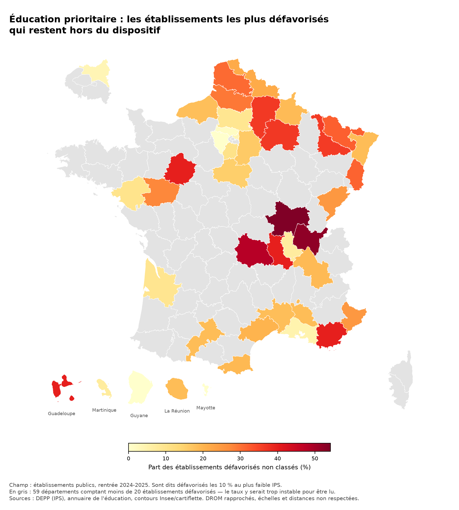
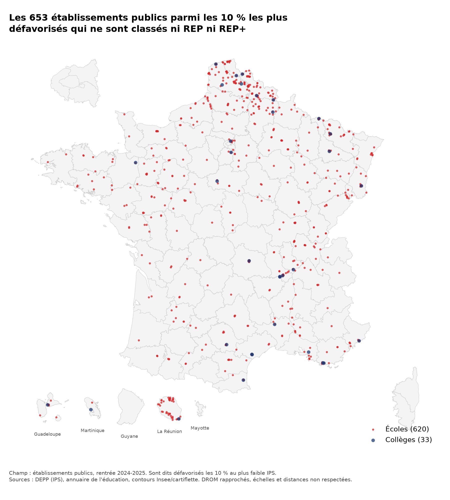

# Éducation prioritaire et réalité sociale des établissements

> Analyse territoriale — données DEPP et annuaire de l'éducation, rentrée 2024-2025.

**Le classement en éducation prioritaire coïncide-t-il avec la réalité sociale des
établissements, mesurée par l'indice de position sociale (IPS) ? Et là où les deux
divergent, que nous apprennent ces exceptions ?**

Ce travail confronte deux mesures du même phénomène : d'un côté le classement
administratif en REP et REP+, de l'autre l'IPS publié par la DEPP pour chaque école
et chaque collège. Il quantifie leur recouvrement, identifie les établissements
socialement défavorisés situés hors du dispositif, et cartographie leur répartition
territoriale.

**Résultat principal.** Sur 30 889 établissements publics, **653 figurent parmi les
10 % socialement les plus défavorisés sans être classés en éducation prioritaire**.
Le ciblage est globalement cohérent — 30 points d'IPS séparent les établissements
classés REP+ des établissements non classés — mais il est nettement plus lâche pour
les écoles (**75,8 %** des plus défavorisées sont couvertes) que pour les collèges
(**93,8 %**). Cet écart découle de l'architecture du dispositif, organisé en réseaux
bâtis autour d'un collège : le classement d'un collège en difficulté est direct,
celui d'une école dépend du collège vers lequel ses élèves sont orientés.

---

## Cadrage préalable

Un premier examen des données écarte d'emblée la question naïve — « le ciblage
est-il correct ? ». Rentrée 2024-2025 :

| Statut | Écoles | IPS moyen | Collèges | IPS moyen |
|---|---:|---:|---:|---:|
| REP+ | 1 300 | **77,2** | 362 | **74,6** |
| REP | 2 317 | **85,7** | 732 | **86,0** |
| Hors dispositif | 26 147 | **107,9** | 5 880 | **109,2** |

L'écart entre REP+ et hors dispositif atteint **30 points pour les écoles et 35 pour
les collèges**, quand la DEPP recommande de ne pas interpréter des différences de
3 points ou moins. Le ciblage est donc globalement très cohérent avec la réalité
sociale mesurée par l'IPS.

L'intérêt de l'analyse se déplace par conséquent vers les **divergences** : quels
établissements socialement défavorisés restent hors dispositif, où se situent-ils,
et ces exceptions dessinent-elles une géographie particulière — rural, villes
moyennes, outre-mer ?

*Chiffres produits par `src/preparation.py` sur 36 738 établissements retenus
(29 764 écoles, 6 974 collèges) après exclusion des établissements non appariés à
l'annuaire et de ceux dont l'IPS n'est pas publié. Voir « Méthode » pour le détail
des exclusions.*

---

## Précautions méthodologiques

**1. Le classement en éducation prioritaire ne repose pas sur l'IPS.** Il s'appuie
sur d'autres critères sociaux. Un écart entre les deux ne constitue donc pas une
erreur de l'administration — c'est la confrontation de deux instruments de mesure,
dont l'analyse des divergences est précisément l'objet de ce travail.

**2. L'éducation prioritaire est organisée en réseaux, non en établissements
isolés.** Un réseau associe un collège aux écoles dont les élèves y sont orientés,
et c'est l'ensemble du réseau qui est classé. Le label d'une école découle donc de
celui de son collège de secteur. Une école socialement favorisée peut être classée
REP parce qu'elle alimente un collège défavorisé : ce n'est pas une anomalie de
ciblage, c'est la conception du dispositif.

Les données confirment cette organisation de deux façons : **aucun lycée** ne porte
de label (0 sur 5 600), et l'on compte **environ six écoles labellisées par collège
labellisé** (6 552 pour 1 104), soit l'ordre de grandeur d'un secteur de recrutement.
Le lien école → collège n'étant pas présent dans les fichiers utilisés, cette
structure est cohérente avec les données sans être démontrée par elles ; la liste
officielle des réseaux serait nécessaire pour la confirmer.

Cette organisation n'altère toutefois pas la lisibilité des résultats : l'écart
d'IPS entre établissements classés et non classés est de même ampleur pour les
écoles (−22 points en REP, −31 en REP+) que pour les collèges (−23 et −35). Le
classement des écoles suit donc leur propre réalité sociale presque aussi
étroitement que celui des collèges.

---

## Qu'est-ce que l'IPS ?

L'indice de position sociale est produit par la DEPP. Il associe à chaque profession
et catégorie sociale (PCS) des parents, ou couple de PCS, une **valeur numérique**
résumant un ensemble d'attributs socio-économiques et culturels liés à la réussite
scolaire : conditions de vie, capital culturel, environnement familial. Plus l'IPS
est élevé, plus les élèves sont en moyenne d'origine favorisée.

Ces valeurs de référence proviennent d'une **table de passage PCS → IPS**, établie
statistiquement sur les panels d'élèves de la DEPP — des échantillons suivis dans le
temps et documentés en détail. La table en vigueur depuis la rentrée 2022 s'appuie
sur le panel d'élèves entrés en CP en 2011.

Deux niveaux à ne pas confondre : l'IPS d'un **élève** est la valeur associée à la
PCS de ses parents ; l'IPS d'un **établissement** est la moyenne des IPS de ses
élèves.

**Ce que l'IPS ne mesure pas.** Il ne dit rien des résultats scolaires. Un
établissement à IPS faible accueille un public socialement défavorisé, ce qui ne
préjuge ni de la qualité de son enseignement ni des performances de ses élèves.
Confondre les deux est le contresens le plus courant sur ces données.

**Marge d'erreur.** L'indice repose sur des PCS déclarées par les familles. La DEPP
recommande explicitement de **ne pas sur-interpréter des différences de 3 points ou
moins** entre IPS moyens. Cette réserve est appliquée dans tout ce travail.

**Une publication obtenue par voie contentieuse.** Ces données sont restées non
publiques jusqu'en 2022, le ministère craignant qu'elles ne servent à contourner la
carte scolaire. Après trois refus successifs malgré une saisine de la Commission
d'accès aux documents administratifs, le journaliste Alexandre Léchenet
(*La Gazette des communes*) a obtenu du tribunal administratif de Paris, par une
décision du 13 juillet 2022, que le ministère lui transmette les IPS. La DEPP les a
publiés sur data.education.gouv.fr en octobre 2022. L'existence même de ce jeu de
données relève ainsi d'une question de politique publique de la donnée — celle de
l'ouverture des statistiques administratives.

---

## Données

| Jeu de données | Source | Lignes | Rentrées couvertes |
|---|---|---|---|
| IPS des écoles | data.education.gouv.fr — `fr-en-ips-ecoles-ap2022` | 97 080 | 2022-23, 2023-24, 2024-25 |
| IPS des collèges | data.education.gouv.fr — `fr-en-ips-colleges-ap2023` | 21 061 | 2023-24, 2024-25, 2025-26 |
| Annuaire de l'éducation | data.education.gouv.fr — `fr-en-annuaire-education` | 68 581 | millésime courant |

*Effectifs relevés le 22 septembre 2026.*

**Deux points méthodologiques structurants :**

1. **Les fichiers IPS sont des panels, pas des instantanés.** Malgré leurs
   identifiants (`ap2022`, `ap2023`), chacun couvre trois rentrées scolaires. La
   rentrée la plus récente commune aux deux niveaux est **2024-2025** : c'est la
   référence retenue pour toute comparaison écoles / collèges.

2. **La jointure avec l'annuaire se fait sur le code UAI**, nommé `uai` dans les
   fichiers IPS et `identifiant_de_l_etablissement` dans l'annuaire. L'annuaire
   apporte les coordonnées géographiques (`latitude`, `longitude`), indispensables à
   la cartographie, ainsi que l'appartenance à l'**éducation prioritaire** (REP/REP+)
   — variable de croisement à fort intérêt analytique.

---

## Reproduire l'analyse

```bash
git clone <url-du-depot>
cd ips_inegalites_scolaires
uv sync
uv run python -m src.download
uv run python -m src.preparation
uv run python -m src.analyse
uv run python -m src.cartographie
```

`uv sync` installe Python 3.12 et les dépendances aux versions exactes figées dans
`uv.lock`. Aucune donnée n'est versionnée : `src/download.py` reconstruit intégralement
`data/raw/` depuis l'API du ministère.

| Module | Rôle |
|---|---|
| `src/download.py` | télécharge les trois jeux de données bruts |
| `src/preparation.py` | nettoie, joint, contrôle les biais d'exclusion |
| `src/analyse.py` | couverture, ciblage, sensibilité au seuil, divergences territoriales |
| `src/cartographie.py` | les deux cartes |

---

## Structure du dépôt

```
data/raw/          données brutes, en lecture seule, non versionnées
data/processed/    données nettoyées, produites par les scripts
docs/              dictionnaire des données
notebooks/         exploration — brouillon, non destiné à la relecture
src/               code réutilisable
outputs/figures/   cartes (versionnées : elles font partie du livrable)
outputs/tables/    tableaux de résultats
```

---

## Méthode

### Construction du fichier d'analyse

`src/preparation.py` part des trois fichiers bruts et produit
`data/processed/etablissements_2024_2025.csv` : une ligne par établissement.

| Étape | Effet |
|---|---:|
| Fichiers IPS bruts (3 rentrées) | 118 141 lignes |
| Filtrage sur la rentrée 2024-2025 | 39 481 |
| Exclusion des non-appariés à l'annuaire | −307 |
| Exclusion des IPS non publiés | −2 505 |
| **Retenus** (chevauchement de 69 lignes) | **36 738** |

Les 36 738 établissements retenus disposent tous de coordonnées géographiques.

### Contrôles effectués

**Doublons de l'annuaire.** 75 UAI y figurent en double. Avant d'en conserver
arbitrairement la première occurrence, on vérifie que les lignes concernées ne se
contredisent pas : **aucune divergence** sur les coordonnées ni sur le statut
d'éducation prioritaire. Le choix est donc sans conséquence. La jointure est par
ailleurs déclarée `one_to_one`, ce qui la fait échouer bruyamment plutôt que de
dupliquer silencieusement des lignes.

**Biais d'exclusion des IPS non publiés.** 2 505 établissements (6,3 %), presque
exclusivement des écoles, n'ont pas d'IPS publié — la DEPP ne diffuse l'indice que
pour les écoles ayant compté au moins 25 élèves de CM2 sur cinq ans. Ces petites
écoles, majoritairement rurales, ne sont **que 4,3 % à relever de l'éducation
prioritaire, contre 12,3 % de l'ensemble**. Leur exclusion retire donc surtout des
établissements hors dispositif : elle est peu susceptible de fausser la
comparaison, sans être pour autant neutre (environ 110 établissements classés sont
perdus).

**Établissements non appariés.** 307 établissements (0,8 %) sont absents de
l'annuaire, dont 295 écoles, concentrées dans le Pas-de-Calais, la Seine-Maritime
et la Charente-Maritime. Vraisemblablement fermés ou regroupés entre la collecte de
l'IPS et la mise à jour de l'annuaire.

### Mesures retenues

L'analyse reprend le cadre de l'évaluation d'un dispositif de ciblage. Deux
variables binaires sont croisées : être parmi les X % d'établissements au plus faible
IPS (la mesure), et être classé REP ou REP+ (la décision administrative). Deux taux
en découlent :

- **Couverture** — parmi les établissements les plus défavorisés, quelle part est
  classée ? Répond à : *le dispositif laisse-t-il des établissements de côté ?*
- **Ciblage** — parmi les établissements classés, quelle part figure parmi les plus
  défavorisés ? Répond à : *le dispositif classe-t-il des établissements qui ne sont
  pas les plus en difficulté ?*

Les deux ne disent pas la même chose et évoluent en sens contraire : élargir le
dispositif améliore la couverture et dégrade le ciblage. Le rang social est calculé
séparément pour les écoles et les collèges, dont les distributions d'IPS diffèrent.

Le seuil de 10 % étant conventionnel, une **analyse de sensibilité** l'accompagne
systématiquement (5 %, 10 %, 15 %, 20 %, 25 %).

### Choix cartographiques

Les contours départementaux proviennent de `cartiflette`, package du laboratoire
d'innovation de l'Insee redistribuant les fonds IGN ADMIN EXPRESS, dans sa variante
« DROM rapprochés » — convention des publications de l'Insee.

Deux conséquences traitées explicitement dans `src/cartographie.py` :

1. Les coordonnées des établissements étant réelles alors que le fond déplace les
   DROM, la transformation appliquée à chaque territoire ultramarin est déduite de
   la comparaison des emprises, puis appliquée aux points. Elle est **vérifiée par
   contrôle d'appartenance** : chacun des 653 points doit tomber dans son département
   sur le fond transformé, faute de quoi le module échoue sans produire la figure.
2. Les départements comptant moins de 20 établissements défavorisés sont laissés en
   gris. Un taux calculé sur un effectif plus faible varierait de plusieurs points
   au gré d'un seul établissement.

## Résultats

Champ : **30 889 établissements publics** (25 564 écoles, 5 325 collèges), rentrée
2024-2025. Le privé sous contrat est écarté du calcul de couverture : **aucun de ses
5 849 établissements n'est classé REP ou REP+**, y compris les 26 qui figurent parmi
les 10 % les plus défavorisés. L'éducation prioritaire est un dispositif de
l'enseignement public ; les y inclure dégraderait mécaniquement le taux de couverture
sans rien mesurer.

### 1. Le dispositif vise le cinquième inférieur, pas le dixième

En retenant comme référence les 10 % d'établissements au plus faible IPS, seuls 46 %
des collèges classés et 54 % des écoles classées en font partie. Mais le taux monte à
76 % et 78 % lorsqu'on élargit la référence aux 20 % les plus défavorisés.

| Seuil retenu | Couverture collèges | Couverture écoles | Ciblage collèges | Ciblage écoles |
|---|---:|---:|---:|---:|
| 5 % | 98,5 % | 85,9 % | 23,9 % | 30,2 % |
| 10 % | 93,8 % | 75,8 % | 45,7 % | 53,8 % |
| 15 % | 87,3 % | 65,0 % | 63,5 % | 68,9 % |
| 20 % | 78,3 % | 55,3 % | 75,9 % | 78,2 % |
| 25 % | 69,3 % | 47,5 % | 84,4 % | 84,3 % |

L'apparent défaut de ciblage au seuil de 10 % n'en est donc pas un : il traduit le
fait que le périmètre de l'éducation prioritaire correspond approximativement au
cinquième le plus défavorisé des établissements publics.

### 2. Les collèges sont presque tous couverts, les écoles beaucoup moins

C'est le résultat le plus net.

| | Défavorisés (10 % plus bas) | Non classés | Couverture |
|---|---:|---:|---:|
| Collèges | 533 | **33** | **93,8 %** |
| Écoles | 2 567 | **620** | **75,8 %** |

Seuls 33 collèges parmi les plus défavorisés échappent au dispositif, contre 620
écoles. Cet écart est cohérent avec l'architecture de la politique : l'éducation
prioritaire est constituée de réseaux bâtis autour d'un collège, auxquels les écoles
sont rattachées. Le classement d'un collège en difficulté est direct ; celui d'une
école dépend du collège vers lequel ses élèves sont orientés. Une école très
défavorisée dont le collège de secteur ne l'est pas suffisamment reste hors
dispositif.

**Les divergences entre classement administratif et réalité sociale se concentrent
donc au niveau des écoles, et découlent d'un trait de conception du dispositif plutôt
que d'erreurs de classement individuelles.**

### 3. L'outre-mer cumule un désavantage massif et une meilleure couverture

| | Établissements | Part dans les 10 % les plus défavorisés | Couverture |
|---|---:|---:|---:|
| Métropole | 29 809 | 8,8 % | 77,0 % |
| Outre-mer | 1 080 | **43,2 %** | **89,7 %** |

Près d'un établissement ultramarin sur deux figure parmi les 10 % les plus
défavorisés de France, contre moins d'un sur dix en métropole. Ces territoires sont
par ailleurs mieux couverts que la métropole.

### 4. La couverture varie fortement entre départements, sans lien avec leur niveau social

Parmi les 42 départements comptant au moins 20 établissements défavorisés, la
couverture s'échelonne de **45,8 %** (Saône-et-Loire) à la couverture intégrale.

**Une hypothèse a été testée puis écartée** : celle selon laquelle les poches de
pauvreté isolées dans des départements globalement aisés seraient moins bien
couvertes. La corrélation entre IPS médian départemental et taux de couverture est
de **−0,08**, soit nulle, et la relation n'est pas monotone — ce sont les
départements du tiers médian qui affichent la couverture la plus faible (77,4 %),
devant le tiers le plus pauvre (81,7 %) et le tiers le plus aisé (84,9 %).

La variabilité départementale est donc réelle et forte, mais elle ne s'explique pas
par la richesse du département. Elle appelle d'autres pistes : l'ancienneté de la
carte de l'éducation prioritaire, dont la dernière révision d'ampleur remonte à
2015, ou des différences de pratique entre académies.

### Cartographie



Les départements en gris comptent moins de 20 établissements défavorisés : le taux y
serait trop instable pour être lu. Cette réserve concerne 59 départements sur 101 —
dans la majorité du territoire, les établissements relevant des 10 % les plus
défavorisés sont trop peu nombreux pour qu'un taux départemental ait un sens.



La carte de points donne à voir ce que les taux masquent : la dispersion. Les
établissements concernés ne forment pas quelques poches identifiables mais un semis
réparti sur tout le territoire, avec des concentrations dans le Nord, le
Pas-de-Calais et à La Réunion.

*Les cartes utilisent la convention des DROM rapprochés : les départements d'outre-mer
sont déplacés et redimensionnés pour figurer auprès de la métropole. Elles ne
permettent donc aucune mesure de distance ou de surface. Le repositionnement des
points est vérifié par contrôle d'appartenance — chacun des 653 établissements doit
tomber à l'intérieur de son département sur le fond transformé, faute de quoi la
figure n'est pas produite.*

## Limites

### Ce que mesure l'indicateur

**L'IPS est un indice construit, pas une observation directe.** Il repose sur les
PCS déclarées par les familles et enregistrées par les établissements. La DEPP
recommande de ne pas interpréter des différences de 3 points ou moins : les
classements fins entre établissements ou entre départements proches n'ont pas de
sens.

**L'IPS des écoles est rétrospectif.** Il est calculé sur les élèves de CM2 dont les
PCS sont connues à leur entrée en sixième, et correspond à la moyenne des anciens
élèves sur cinq ans. Il décrit donc le public de l'école au cours du quinquennat
écoulé, non celui qui y est actuellement scolarisé. Une école dont le recrutement
social s'est récemment dégradé apparaît meilleure qu'elle ne l'est.

**L'IPS ne dit rien des résultats scolaires.** Ce travail porte sur la composition
sociale des établissements, jamais sur leur performance.

### Le champ retenu

**2 743 établissements sont exclus** : 2 505 sans IPS publié (écoles de moins de
25 élèves de CM2 sur cinq ans) et 307 absents de l'annuaire, dont 69 cumulent les
deux motifs. Le biais a été mesuré —
les exclus ne sont que 4,3 % à relever de l'éducation prioritaire contre 12,3 % de
l'ensemble — mais il n'est pas nul : environ 110 établissements classés disparaissent
de l'analyse.

**Le privé sous contrat est écarté** du calcul de couverture, aucun de ses
établissements n'étant classé. La question de la ségrégation entre secteurs public
et privé, pourtant centrale dans le débat sur les inégalités scolaires, n'est donc
pas traitée ici.

**Les lycées sont hors champ**, l'éducation prioritaire s'arrêtant au collège.

**Le fichier IPS des écoles porte la mention « n'est plus actualisé »** dans les
métadonnées du ministère. Les résultats valent pour la rentrée 2024-2025 et ne
pourront pas être prolongés à partir de cette source.

### Les choix de méthode

**Aucune pondération par les effectifs d'élèves — c'est la limite principale.** Ni
les fichiers IPS ni l'annuaire ne fournissent d'effectif. Une école de 30 élèves pèse
donc autant qu'une école de 400 dans chaque taux calculé ici. Conséquence directe :
les taux de couverture décrivent une part d'**établissements**, jamais une part
d'**élèves**. Or une politique éducative vise des élèves. Le chiffre de 653
établissements non couverts ne doit en aucun cas être converti en nombre d'enfants
concernés.

**Le seuil de 10 % est conventionnel.** L'analyse de sensibilité montre que la
hiérarchie écoles / collèges est stable de 5 % à 25 %, mais que le nombre absolu
d'établissements non couverts varie de 184 à 3 775 selon le seuil retenu. Aucun
chiffre absolu ne doit être cité sans son seuil.

**Une seule rentrée est analysée.** Aucune évolution n'est mesurée.

**Les taux départementaux reposent souvent sur de très petits effectifs.** 59
départements sur 101 comptent moins de 20 établissements défavorisés et sont pour
cette raison exclus de la carte. Pour ceux qui figurent, un écart de quelques
établissements déplace le taux de plusieurs points.

### Ce que ce travail ne dit pas

**Ce n'est pas une évaluation de l'efficacité de l'éducation prioritaire.** On mesure
la cohérence entre un classement et un indicateur social, jamais les effets du
dispositif sur les élèves qui en bénéficient.

**Aucune relation causale n'est établie.** L'analyse est intégralement descriptive.

**Le décalage temporel entre les deux instruments n'est pas traité.** La carte de
l'éducation prioritaire a été refondue en 2015 ; les IPS mobilisés datent de
2024-2025. Une divergence peut donc traduire une évolution sociale survenue depuis le
classement autant qu'une inadéquation d'origine. Distinguer les deux supposerait de
croiser une série temporelle d'IPS avec l'historique des révisions de la carte.

**Les critères réels du classement ne sont pas mobilisés.** Le classement en REP et
REP+ repose sur un indice social composite propre, non sur l'IPS. Ce travail
confronte deux instruments de mesure ; il ne reconstitue pas la décision
administrative et ne peut donc pas conclure qu'un établissement est « mal classé ».

**L'explication par les réseaux reste une interprétation.** Le lien entre une école
et son collège de secteur n'est présent dans aucun des fichiers utilisés. La
cohérence du rapport observé — six écoles classées par collège classé — appuie cette
lecture sans la démontrer.

---

## Prolongements possibles

- Croiser avec la liste officielle des réseaux d'éducation prioritaire pour vérifier
  directement le mécanisme d'héritage du label entre collège et écoles.
- Mobiliser `donnees-ips-ecoles`, qui couvre neuf rentrées, en traitant explicitement
  la rupture méthodologique de 2022, afin d'examiner si les divergences se creusent.
- Croiser avec les données de revenu médian communal de l'Insee (Filosofi) pour
  confronter l'IPS à une mesure indépendante du niveau de vie local.
- Étendre l'analyse aux lycées, hors dispositif mais dotés d'un fichier IPS.

---

## Sources

**Données**

- [IPS des écoles](https://data.education.gouv.fr/explore/dataset/fr-en-ips-ecoles-ap2022/) — DEPP
- [IPS des collèges](https://data.education.gouv.fr/explore/dataset/fr-en-ips-colleges-ap2023/) — DEPP
- [Annuaire de l'éducation](https://data.education.gouv.fr/explore/dataset/fr-en-annuaire-education/) — ministère chargé de l'Éducation nationale
- Contours départementaux : [cartiflette](https://github.com/InseeFrLab/cartiflette), laboratoire d'innovation de l'Insee, d'après IGN ADMIN EXPRESS

**Méthodologie de l'IPS**

- Rocher, T. (2016), « Construction d'un indice de position sociale des élèves », *Éducation & formations*, DEPP, n° 90, pp. 5-27
- Dauphant, F., Evain, F., Guillerm, M., Simon, C., Rocher, T. (2023), « L'indice de position sociale (IPS) : un outil statistique pour décrire les inégalités sociales entre établissements », *Note d'information de la DEPP* n° 23.16
- [L'indice de position sociale (IPS)](https://www.education.gouv.fr/l-indice-de-position-sociale-ips-357755) — ministère chargé de l'Éducation nationale

**Sur la publication des IPS**

- [Indice de position sociale](https://fr.wikipedia.org/wiki/Indice_de_position_sociale) — Wikipédia
- [Comment un journaliste a obtenu les données sur les IPS](https://www.lucyol.fr/blog/ips)
- [Mixité sociale à l'École : comment est construit « l'IPS » ?](https://www.publicsenat.fr/actualites/societe/mixite-sociale-a-lecole-comment-est-construit-lips-lindice-de-position-sociale) — Public Sénat

Voir aussi [`docs/dictionnaire_donnees.md`](docs/dictionnaire_donnees.md) pour la
description détaillée des trois fichiers et des pièges de jointure.

## Auteur

Rémy Darquin
