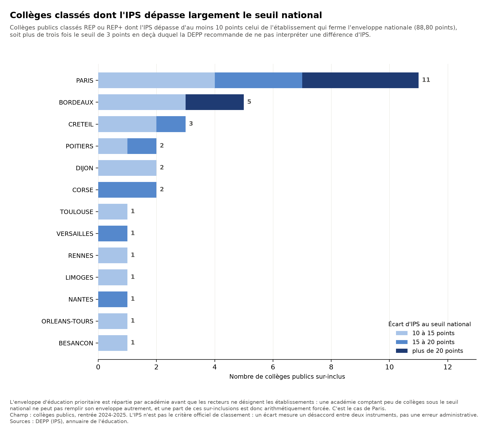
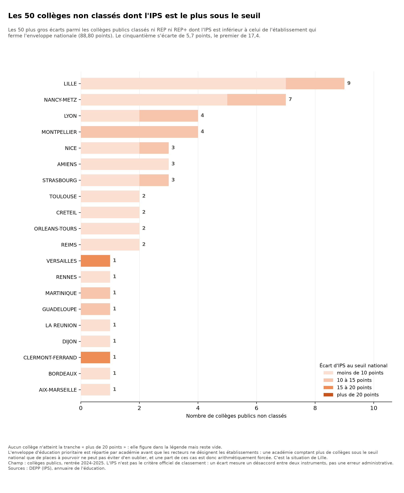

# Éducation prioritaire et réalité sociale des collèges

> Analyse territoriale — données DEPP et annuaire de l'éducation, rentrée 2024-2025.

**Le classement en éducation prioritaire coïncide-t-il avec la réalité sociale des
collèges, mesurée par l'indice de position sociale (IPS) ? Et là où les deux
divergent, que nous apprennent ces exceptions ?**

Ce travail confronte deux mesures du même phénomène : d'un côté le classement
administratif en REP et REP+, de l'autre l'IPS publié par la DEPP pour chaque
collège. Il quantifie leur recouvrement, identifie les collèges socialement
défavorisés situés hors du dispositif, et cartographie leur répartition
territoriale.

**Le champ est celui des collèges**, et c'est un choix de fond : l'indice social qui
a servi à bâtir la carte de 2015 a été construit *au niveau du collège*, les écoles
n'ayant été labellisées qu'en héritant du label de leur collège de secteur, faute de
base de données les concernant. Le collège est donc l'unité à laquelle la décision a
réellement été prise — et la seule où la confronter à l'IPS ait un sens direct.

**Résultat principal.** Sur 5 325 collèges publics, **33 seulement figurent parmi les
10 % socialement les plus défavorisés sans être classés**, soit une couverture de
**93,8 %**. Une seconde mesure, affranchie de tout seuil conventionnel, confirme ce
constat et le précise : rapportée à l'enveloppe réellement allouée, **90,6 % des
collèges sont exactement à leur place**, et l'écart total vaut 2,01 points d'IPS par
collège classé — en deçà du seuil de 3 points que la DEPP juge interprétable.

Restent les exceptions, peu nombreuses mais nettes : **48 collèges s'écartent de plus
de 10 points**, dont 32 classés malgré un IPS élevé et 16 non classés malgré un IPS
très bas. Paris en concentre à lui seul onze, pour une raison qui tient moins à la
décision du recteur qu'à l'arithmétique de l'enveloppe.

---

## Cadrage préalable

Un premier examen des données écarte d'emblée la question naïve — « le ciblage
est-il correct ? ». Rentrée 2024-2025 :

| Statut | Collèges | IPS moyen |
|---|---:|---:|
| REP+ | 362 | **74,6** |
| REP | 732 | **86,0** |
| Hors dispositif (public) | 4 231 | **104,9** |
| *Privé sous contrat* | *1 649* | *120,3* |

L'écart entre REP+ et collèges publics hors dispositif atteint **30 points d'IPS**,
quand la DEPP recommande de ne pas interpréter des différences de 3 points ou moins.
Le ciblage est donc globalement très cohérent avec la réalité sociale mesurée par
l'IPS.

L'intérêt de l'analyse se déplace par conséquent vers les **divergences** : quels
collèges socialement défavorisés restent hors dispositif, quels collèges favorisés
sont classés, où se situent-ils, et ces exceptions dessinent-elles une géographie
particulière ?

*Chiffres produits par `src/preparation.py` sur 6 974 collèges retenus après
exclusion de ceux non appariés à l'annuaire et de ceux dont l'IPS n'est pas publié.
Voir « Méthode » pour le détail des exclusions.*

---

## Précautions méthodologiques

**1. Le classement en éducation prioritaire ne repose pas sur l'IPS.** Il s'appuie
sur d'autres critères sociaux. Un écart entre les deux ne constitue donc pas une
erreur de l'administration — c'est la confrontation de deux instruments de mesure,
dont l'analyse des divergences est précisément l'objet de ce travail.

**2. Le collège est l'unité de décision du dispositif.** L'éducation prioritaire est
organisée en réseaux : un réseau associe un collège aux écoles dont les élèves y
sont orientés, et c'est l'ensemble du réseau qui est classé. Le label d'une école
découle donc de celui de son collège de secteur, et non de sa propre situation
sociale.

Ce mécanisme est **établi par le producteur de la politique**, et non déduit des
données : le ministère indique que « les écoles maternelles et élémentaires sont
classées en fonction du collège de secteur ». Les données le confirment de deux
façons : **aucun lycée** ne porte de label (0 sur 5 600), et l'on compte **environ
six écoles labellisées par collège labellisé** (6 552 pour 1 104), soit l'ordre de
grandeur d'un secteur de recrutement.

**C'est la raison pour laquelle ce travail se restreint aux collèges.** Confronter
l'IPS d'une école à son label reviendrait à juger une décision qui n'a pas été prise
à son niveau. Au collège, en revanche, la comparaison porte sur l'établissement même
que l'administration a évalué.

**3. Le seuil de 10 % ne mesure pas ce qu'il semble mesurer.** Le dispositif classe
20,5 % des collèges publics ; le décile le plus défavorisé n'en contient donc que la
moitié. Le « ciblage » calculé à ce seuil est par conséquent **plafonné à 48,7 %
quelle que soit la qualité du classement**. C'est ce qui a motivé la mesure sans
seuil présentée plus bas, fondée sur l'enveloppe réellement allouée.

---

## Comment le classement en éducation prioritaire est construit

Ce travail confronte l'IPS au classement REP/REP+. Encore faut-il savoir comment ce
classement a été établi — c'est la condition pour interpréter correctement les
écarts. Source : Cour des comptes, *L'éducation prioritaire, une politique publique
à repenser*, 2025.

### La procédure de 2015, en trois temps

**1. Un indice social unique**, construit par la DEPP **au niveau du collège**. Il
agrège quatre taux :

| Variable |
|---|
| Élèves appartenant aux catégories sociales défavorisées |
| Élèves boursiers (taux 3) |
| Élèves résidant dans ou à moins de **300 mètres** d'une ZUS, devenue QPV |
| Élèves en retard à l'entrée en classe de sixième |

L'agrégation ne se fait pas par moyenne pondérée : l'indice est « construit au
travers d'une **régression économétrique**, c'est-à-dire d'une analyse des
corrélations entre les facteurs mentionnés ». Les poids sont estimés, non choisis.

*À noter : le revenu médian du secteur a été testé et écarté, au motif qu'« intégrant
tous les foyers fiscaux d'un quartier, dont les retraités et les personnes sans
enfants, il ne constitue pas une photographie de la population scolaire ».*

**2. Un dialogue local** conduit par les recteurs d'octobre à décembre 2014, la liste
finale étant arrêtée par le ministre.

**3. Les écoles classées par héritage.** « L'absence de base de données concernant
les écoles ne permettant pas de construire un indice qui leur est propre, le choix a
donc été fait de labelliser les écoles selon une logique de réseau. » Ce n'est donc
pas un choix pédagogique mais une **contrainte de données**. C'est aussi la
justification directe du champ retenu ici : l'indice social n'a jamais existé qu'au
niveau du collège.

**Résultat :** 1 093 réseaux, soit **362 collèges en REP+ et 731 en REP**.

### Cinq limites du dispositif de classement

**1. L'indice n'a pas été appliqué.** C'est le point le plus important pour ce
travail. « La carte théorique correspondant à ces critères nécessitait **350 réseaux
entrants et 350 réseaux sortants**. Or les contextes locaux n'ont permis de procéder
qu'à **195 sorties et 206 entrées** » — soit environ 57 % des mouvements prescrits.
Le périmètre devait rester constant, autour de 500 000 collégiens : chaque entrée
exigeait une sortie, et retirer un label s'est révélé politiquement très difficile.
Une mesure de compensation a même dû être créée — maintien des indemnités ZEP
pendant trois ans et bonification du barème de mutation.

**Conséquence directe : une partie des divergences mesurées ici ne provient pas de
l'IPS, mais du fait que la carte s'écarte de son propre indice social.**

**2. Le premier degré n'est pas évalué pour lui-même.** Le classement y étant
hérité, la Cour nomme deux désajustements symétriques qu'il produit. Ils sortent du
champ de ce travail, mais ils rappellent que la décision se prend au collège.

**3. La carte est figée depuis dix ans.** Elle « devait être réactualisée tous les
quatre ans. Or l'entreprise, délicate, n'a pas été reconduite depuis dix ans ».

**4. Le label est binaire.** L'allocation de moyens étant conditionnée à la
labellisation, le mécanisme « apparaît comme binaire et ne permet d'offrir une réelle
progressivité dans les ressources ». Les effets de seuil sont forts.

**5. L'indice n'est pas reproductible.** Ni la spécification de la régression, ni les
coefficients, ni la valeur du seuil séparant REP+ de REP ne sont publics. L'instrument
qui a déterminé le classement de 1 093 réseaux ne peut pas être recalculé à partir
des sources ouvertes.

Et une critique de fond, posée par le SGMAP avant même la réforme : **« est-ce qu'une
politique est encore prioritaire quand elle concerne 20 % d'une population ? »**

---

## Qu'est-ce que l'IPS ?

L'indice de position sociale est produit par la DEPP. Il associe à chaque profession
et catégorie sociale (PCS) des parents, ou couple de PCS, une **valeur numérique**
résumant un ensemble d'attributs socio-économiques et culturels liés à la réussite
scolaire : conditions de vie, capital culturel, environnement familial. Plus l'IPS
est élevé, plus les élèves sont en moyenne d'origine favorisée.

Ces valeurs de référence proviennent d'une **table de passage PCS → IPS**, établie
statistiquement sur les panels d'élèves de la DEPP — des échantillons suivis dans le
temps et documentés en détail. La table en vigueur depuis la rentrée 2022 s'appuie
sur le panel d'élèves entrés en CP en 2011.

Deux niveaux à ne pas confondre : l'IPS d'un **élève** est la valeur associée à la
PCS de ses parents ; l'IPS d'un **établissement** est la moyenne des IPS de ses
élèves.

**Ce que l'IPS ne mesure pas.** Il ne dit rien des résultats scolaires. Un
établissement à IPS faible accueille un public socialement défavorisé, ce qui ne
préjuge ni de la qualité de son enseignement ni des performances de ses élèves.
Confondre les deux est le contresens le plus courant sur ces données.

**Marge d'erreur.** L'indice repose sur des PCS déclarées par les familles. La DEPP
recommande explicitement de **ne pas sur-interpréter des différences de 3 points ou
moins** entre IPS moyens. Cette réserve est appliquée dans tout ce travail.

**Une publication obtenue par voie contentieuse.** Ces données sont restées non
publiques jusqu'en 2022, le ministère craignant qu'elles ne servent à contourner la
carte scolaire. Après trois refus successifs malgré une saisine de la Commission
d'accès aux documents administratifs, le journaliste Alexandre Léchenet
(*La Gazette des communes*) a obtenu du tribunal administratif de Paris, par une
décision du 13 juillet 2022, que le ministère lui transmette les IPS. La DEPP les a
publiés sur data.education.gouv.fr en octobre 2022. L'existence même de ce jeu de
données relève ainsi d'une question de politique publique de la donnée — celle de
l'ouverture des statistiques administratives.

---

## Données

| Jeu de données | Source | Lignes | Rentrées couvertes |
|---|---|---|---|
| IPS des collèges | data.education.gouv.fr — `fr-en-ips-colleges-ap2023` | 21 061 | 2023-24, 2024-25, 2025-26 |
| Annuaire de l'éducation | data.education.gouv.fr — `fr-en-annuaire-education` | 68 581 | millésime courant |

*Effectifs relevés le 22 septembre 2026.*

**Deux points méthodologiques structurants :**

1. **Le fichier IPS est un panel, pas un instantané.** Malgré son identifiant
   (`ap2023`), il couvre trois rentrées scolaires. Sans filtre, chaque collège serait
   compté trois fois. La rentrée retenue est **2024-2025**, la plus récente pour
   laquelle l'annuaire et le fichier IPS concordent.

2. **La jointure avec l'annuaire se fait sur le code UAI**, nommé `uai` dans le
   fichier IPS et `identifiant_de_l_etablissement` dans l'annuaire. L'annuaire
   apporte les coordonnées géographiques (`latitude`, `longitude`), indispensables à
   la cartographie, ainsi que l'appartenance à l'**éducation prioritaire** (REP/REP+)
   — variable de croisement à fort intérêt analytique.

---

## Reproduire l'analyse

```bash
git clone <url-du-depot>
cd ips_inegalites_scolaires
uv sync
uv run python -m src.download
uv run python -m src.preparation
uv run python -m src.analyse
uv run python -m src.score_ecart
uv run python -m src.distribution_ecart
uv run python -m src.ecarts_extremes
```

`uv sync` installe Python 3.12 et les dépendances aux versions exactes figées dans
`uv.lock`. Aucune donnée n'est versionnée : `src/download.py` reconstruit intégralement
`data/raw/` depuis l'API du ministère.

| Module | Rôle |
|---|---|
| `src/download.py` | télécharge les deux jeux de données bruts |
| `src/preparation.py` | nettoie, joint, contrôle les biais d'exclusion |
| `src/analyse.py` | couverture, ciblage, sensibilité au seuil, divergences territoriales |
| `src/cartographie.py` | fond de carte partagé : contours, DROM rapprochés, annotations |
| `src/score_ecart.py` | score d'écart d'IPS par collège, aux seuils national et académique |
| `src/distribution_ecart.py` | forme de la distribution de l'écart, aux deux seuils |
| `src/ecarts_extremes.py` | les écarts d'au moins 10 points, des deux côtés, par académie et par département |
| `src/cartographie_score.py` | cartes départementales des écarts significatifs |
| `src/nuage_score.py` | fréquence et nature des écarts, par département |

---

## Structure du dépôt

```
data/raw/          données brutes, en lecture seule, non versionnées
data/processed/    données nettoyées, produites par les scripts
docs/              dictionnaire des données
notebooks/         exploration — brouillon, non destiné à la relecture
src/               code réutilisable
outputs/figures/   cartes (versionnées : elles font partie du livrable)
outputs/tables/    tableaux de résultats
```

---

## Méthode

### Construction du fichier d'analyse

`src/preparation.py` part des deux fichiers bruts et produit
`data/processed/colleges_2024_2025.csv` : une ligne par collège.

| Étape | Effet |
|---|---:|
| Fichier IPS brut (3 rentrées) | 21 061 lignes |
| Filtrage sur la rentrée 2024-2025 | 6 987 |
| Exclusion des non-appariés à l'annuaire | −12 |
| Exclusion des IPS non publiés | −1 |
| **Retenus** | **6 974** |

Les 6 974 collèges retenus disposent tous de coordonnées géographiques. Le taux de
perte est ici de **0,2 %** : la confrontation IPS / annuaire est quasi intégrale au
niveau du collège.

### Contrôles effectués

**Conformité des labels à la carte officielle.** Les statuts REP et REP+ de
l'annuaire sont confrontés aux effectifs publiés par le ministère pour la rentrée
2023 :

| | Carte officielle | Annuaire | Fichier d'analyse |
|---|---:|---:|---:|
| Collèges REP | 731 | 732 | 732 |
| Collèges REP+ | 362 | 372 | 362 |

L'écart d'une unité en REP et de dix en REP+ entre la carte officielle et l'annuaire
est imputable à la différence de millésime : les labels de l'annuaire reproduisent
fidèlement la carte ministérielle.

La dernière colonne compte **dix collèges REP+ de moins que l'annuaire**, et
l'origine a été tracée : ils ne sont pas écartés par les exclusions ci-dessus, ils
n'ont tout simplement **aucune ligne dans le fichier IPS pour 2024-2025** — huit y
figurent pour d'autres rentrées, deux n'y apparaissent jamais. La perte porte donc
sur 2,7 % des REP+, ce qui atténue très légèrement les écarts mesurés dans la suite :
les collèges concernés sont, par construction, parmi les plus défavorisés.

**Doublons de l'annuaire.** 75 UAI y figurent en double. Avant d'en conserver
arbitrairement la première occurrence, on vérifie que les lignes concernées ne se
contredisent pas : **aucune divergence** sur les coordonnées ni sur le statut
d'éducation prioritaire. Le choix est donc sans conséquence. La jointure est par
ailleurs déclarée `one_to_one`, ce qui la fait échouer bruyamment plutôt que de
dupliquer silencieusement des lignes.

**Biais d'exclusion des IPS non publiés.** Un seul collège (0,01 %) figure dans le
fichier IPS sans valeur diffusée. Le motif d'exclusion qui pesait lourd sur le
premier degré — la DEPP ne diffuse l'indice qu'au-delà de 25 élèves sur cinq ans —
est ici pratiquement sans effet : les collèges sont trop grands pour être concernés.

**Collèges non appariés.** 12 collèges (0,2 %) sont absents de l'annuaire, dispersés
sur huit départements. Vraisemblablement fermés ou regroupés entre la collecte de
l'IPS et la mise à jour de l'annuaire.

### Mesures retenues

L'analyse reprend le cadre de l'évaluation d'un dispositif de ciblage. Deux
variables binaires sont croisées : être parmi les X % de collèges au plus faible IPS
(la mesure), et être classé REP ou REP+ (la décision administrative). Deux taux en
découlent :

- **Couverture** — parmi les collèges les plus défavorisés, quelle part est
  classée ? Répond à : *le dispositif laisse-t-il des collèges de côté ?*
- **Ciblage** — parmi les collèges classés, quelle part figure parmi les plus
  défavorisés ? Répond à : *le dispositif classe-t-il des collèges qui ne sont pas
  les plus en difficulté ?*

Les deux ne disent pas la même chose et évoluent en sens contraire : élargir le
dispositif améliore la couverture et dégrade le ciblage.

Le seuil de 10 % étant conventionnel, une **analyse de sensibilité** l'accompagne
systématiquement (5 %, 10 %, 15 %, 20 %, 25 %). Le module affiche en outre, à chaque
seuil, le **plafond atteignable par le ciblage** — le décile ne peut pas contenir
plus de collèges qu'il n'en compte. Sans ce repère, le ciblage se lit comme une
mesure de qualité alors qu'il dépend d'abord de la taille de l'enveloppe. C'est ce
défaut que corrige le score d'écart présenté plus bas.

### Choix cartographiques

Les contours départementaux proviennent de `cartiflette`, package du laboratoire
d'innovation de l'Insee redistribuant les fonds IGN ADMIN EXPRESS, dans sa variante
« DROM rapprochés » — convention des publications de l'Insee. Les départements
d'outre-mer y sont déplacés et redimensionnés pour figurer auprès de la métropole :
**ces cartes ne permettent donc aucune mesure de distance ni de surface**, et chacune
le rappelle dans sa note.

`src/cartographie.py` fournit le fond commun à toutes les cartes du dépôt — contours,
transformation des DROM et annotation des territoires ultramarins, qui seraient sinon
impossibles à identifier puisqu'ils ne sont ni à leur place ni à leur échelle.

Trois partis sont pris systématiquement :

1. **Un effectif minimal conditionne l'affichage.** Un taux départemental calculé sur
   quelques établissements varierait de plusieurs points au gré d'un seul d'entre
   eux ; les départements concernés sont laissés en gris plutôt qu'affichés avec une
   valeur instable.
2. **Les échelles sont découpées en classes de quantiles**, et non en rampes
   linéaires. La distribution des scores départementaux est très asymétrique :
   quelques départements extrêmes absorberaient toute la dynamique de couleur et
   écraseraient les quatre-vingt-dix autres dans une teinte indistincte. Les bornes
   de classes sont affichées sur chaque barre de couleur.
3. **La nature de la variable commande la palette.** Une grandeur sans polarité reçoit
   une échelle séquentielle d'une seule teinte ; une grandeur signée reçoit une
   échelle divergente dont le point neutre est un gris, et non un blanc qui
   disparaîtrait sur le fond.

## Résultats

Champ : **5 325 collèges publics**, rentrée 2024-2025. Le privé sous contrat est
écarté du calcul de couverture : **aucun de ses 1 649 collèges n'est classé REP ou
REP+**, y compris les 12 qui figurent parmi les 10 % les plus défavorisés.
L'éducation prioritaire est un dispositif de l'enseignement public ; les y inclure
dégraderait mécaniquement le taux de couverture sans rien mesurer.

### 1. Le dispositif vise le cinquième inférieur, pas le dixième

L'éducation prioritaire classe **1 094 collèges publics sur 5 325, soit 20,5 %**. Le
décile le plus défavorisé n'en contient que 533 : il est donc arithmétiquement
impossible d'y loger tous les classés.

| Seuil retenu | Effectif du seuil | Couverture | Ciblage | Plafond du ciblage | Non couverts |
|---|---:|---:|---:|---:|---:|
| 5 % | 265 | 98,5 % | 23,9 % | *24,2 %* | 4 |
| 10 % | 533 | 93,8 % | 45,7 % | *48,7 %* | 33 |
| 15 % | 796 | 87,3 % | 63,5 % | *72,8 %* | 101 |
| 20 % | 1 060 | 78,3 % | 75,9 % | *96,9 %* | 230 |
| 25 % | 1 332 | 69,3 % | 84,4 % | *(sans objet)* | 409 |

La colonne « plafond » est décisive. Au seuil de 10 %, le ciblage ne **peut pas**
dépasser 48,7 % ; les 45,7 % observés en représentent 94 %. Lire ce chiffre comme
« moins de la moitié des collèges classés sont vraiment défavorisés » serait un
contresens : il traduit le fait que le périmètre de l'éducation prioritaire
correspond approximativement au **cinquième** le plus défavorisé, pas au dixième.

### 2. Les collèges défavorisés sont presque tous couverts

| | Effectif |
|---|---:|
| Collèges publics parmi les 10 % au plus faible IPS | 533 |
| dont classés REP ou REP+ | 500 |
| **dont non classés** | **33** |
| Couverture | **93,8 %** |

Trente-trois collèges sur 5 325 — 0,6 % du champ. Au niveau où la décision se prend
réellement, la carte de l'éducation prioritaire laisse donc très peu d'établissements
de côté. C'est un constat favorable au dispositif, et il faut le dire comme tel.

La question intéressante n'est dès lors plus la couverture, mais l'**autre côté** de
l'écart : les collèges classés dont l'IPS ne le justifie pas. Le seuil de 10 % ne
permet pas de l'examiner — c'est l'objet du score d'écart présenté plus bas.

### 3. L'outre-mer cumule un désavantage massif et une meilleure couverture

| | Collèges | Part dans les 10 % les plus défavorisés | Couverture |
|---|---:|---:|---:|
| Métropole | 5 103 | 8,7 % | 93,3 % |
| Outre-mer | 222 | **39,6 %** | **96,6 %** |

Quatre collèges ultramarins sur dix figurent parmi les 10 % les plus défavorisés de
France, contre moins d'un sur douze en métropole. Ces territoires sont par ailleurs
mieux couverts : trois collèges non couverts sur 88 défavorisés. La Guyane et Mayotte
atteignent la couverture intégrale.

### 4. La variabilité départementale n'est pas mesurable sur ce champ

Le champ restreint aux collèges rend ce type d'analyse **impossible à conduire
sérieusement**, et il vaut mieux le dire que produire un chiffre fragile.

Les 533 collèges défavorisés se répartissent sur 74 départements, mais **14
seulement en comptent au moins dix**. La corrélation entre IPS médian départemental
et taux de couverture oscille entre −0,19 et −0,44 selon le minimum d'effectif
retenu, c'est-à-dire qu'elle est entièrement pilotée par une poignée de points. Aucune
conclusion ne peut en être tirée.

Avec 33 collèges non couverts au total, la couverture départementale n'a tout
simplement pas assez de matière. **L'analyse territoriale de ce travail repose donc
sur le score d'écart**, qui ne dépend d'aucun décile et attribue une valeur à chacun
des 5 325 collèges.

---

## Le score d'écart d'IPS

L'analyse de couverture repose sur un seuil conventionnel — les 10 % les plus
défavorisés. Une seconde mesure s'en dispense en prenant pour référence
**l'enveloppe réellement allouée**.

### Le principe

Le dispositif classe 1 094 collèges publics sur 5 325. Une règle qui classerait le
même *nombre* d'établissements, mais d'après leur seul IPS, retiendrait les 1 094
IPS les plus faibles — c'est-à-dire tous ceux situés sous **88,80 points**, l'IPS du
collège qui ferme l'enveloppe. Ce seuil n'est donc pas choisi : il découle de la
décision budgétaire elle-même.

Chaque établissement reçoit un score :

- **0** s'il est classé et sous le seuil, ou non classé et au-dessus — conforme ;
- **son écart d'IPS au seuil** dans les deux cas restants.

Ces deux cas sont de sens opposé : **oubli** (sous le seuil, non classé) et
**sur-inclusion** (au-dessus du seuil, classé). Les confondre ferait disparaître
l'information la plus intéressante, ils sont donc distingués partout.

Les deux types d'erreur étant en nombre égal par construction, le seuil s'élimine de
la somme des scores, qui vaut alors exactement l'écart de masse d'IPS entre
l'allocation réelle et l'allocation optimale à enveloppe égale. Cette identité est
recalculée à chaque exécution et interrompt le programme si elle est violée.

**Résultat d'ensemble : 90,6 % des collèges publics ont un score nul**, et la médiane
des écarts non nuls est de 3,2 points — à peine au-dessus du seuil de 3 points en
deçà duquel la DEPP recommande de ne rien interpréter. Rapporté au nombre de places,
l'écart total vaut 2,01 points d'IPS par collège classé.

### La forme de la distribution


La variable est à **inflation de zéros**, ce qui impose deux précautions de tracé.
La barre du zéro est tronquée et son effectif annoté, faute de quoi elle écraserait
tout le reste ; et les classes sont calées pour que zéro tombe au *centre* d'une
barre, sans quoi les conformes se répartiraient sur deux barres voisines et la masse
centrale paraîtrait deux fois plus petite qu'elle n'est.

**L'écart, quand il existe, est le plus souvent minuscule.** La médiane des écarts
non nuls est de **3,2 points**, soit à peine au-dessus du seuil que la DEPP juge
interprétable. La moitié des collèges non conformes s'écartent donc d'une quantité
que l'indicateur ne permet pas de lire.

**L'asymétrie ne porte pas sur les effectifs mais sur les queues.** Les deux côtés
comptent presque le même nombre de collèges — 249 oublis contre 250 sur-inclusions —
mais ils ne se répartissent pas de la même façon. Les oublis s'entassent près de
zéro : 135 des 249 restent sous 3 points. Les sur-inclusions peuplent la queue :
141 des 250 la dépassent. Visuellement, la barre la plus haute est orange, juste à
droite de zéro, mais c'est le bleu qui s'étire jusqu'à −32 quand l'orange s'arrête à
+18. Le dispositif se trompe aussi souvent dans les deux sens, mais il se trompe
plus fort lorsqu'il classe.

Le trait noir donne la même distribution lorsque le seuil est recalculé académie par
académie. **Le resserrement porte sur la queue, non sur le centre** : la part de
conformes ne gagne que 1,4 point (90,6 → 92,0 %), mais le centile 99 tombe de 20,2 à
17,1. Autrement dit, changer d'étalon élimine les cas spectaculaires sans rien
changer au désaccord de fond.

Le tableau placé sous le graphe donne la répartition chiffrée. Ses plages sont
**symétriques autour de zéro**, de sorte qu'une asymétrie entre les deux moitiés soit
une propriété des données et non du découpage.

| Seuil | < −10 | −10 à −3 | **−3 à +3** | +3 à +10 | > +10 |
|---|---:|---:|---:|---:|---:|
| National | 0,5 % | 2,1 % | **95,2 %** | 1,8 % | 0,3 % |
| Académique | 0,4 % | 2,0 % | **96,1 %** | 1,5 % | 0,1 % |

Trois lectures. **Plus de 95 % des collèges tiennent dans ± 3 points**, c'est-à-dire
dans la marge que la DEPP juge ininterprétable. **Les deux moitiés ne s'équilibrent
pas** : 2,6 % des collèges sont du côté de la sur-inclusion contre 2,1 % du côté de
l'oubli, et l'écart se creuse aux extrêmes — 0,5 % au-delà de −10 contre 0,3 % au-delà
de +10. **Le seuil académique agit surtout sur la tranche extrême des oublis**, qui
passe de 0,3 % à 0,1 %, soit d'environ seize collèges à cinq.

### Les 48 cas au-delà de 10 points

Restent les cas qu'aucune imprécision de mesure ne peut expliquer : **48 collèges**
dont l'écart au seuil atteint 10 points, soit plus de trois fois le seuil
d'interprétabilité. Ils se répartissent en **32 sur-inclusions et 16 oublis** — deux
fois plus de collèges classés à tort, au sens de l'IPS, que de collèges oubliés.

#### Les sur-inclusions



Treize académies sur trente sont concernées ; les dix-sept autres n'ont aucun cas.
**Paris en concentre 11 à lui seul**, dont 4 des 6 écarts supérieurs à 20 points.
Bordeaux suit avec 5, dont les 2 autres écarts extrêmes. À elles deux, ces académies
détiennent la totalité de la tranche haute.


Seize départements sont concernés : Paris (11), la Gironde (3), puis la Corse-du-Sud,
la Dordogne, la Seine-Saint-Denis et la Nièvre (2 chacun). Le fait notable est
l'**absence de motif géographique** : en dehors de deux foyers urbains, les cas sont
isolés et dispersés, sans continuité territoriale, et aucun DROM n'est concerné. Il
ne s'agit donc pas d'un phénomène régional mais d'une accumulation de situations
locales.

#### Les oublis



**Aucun oubli n'atteint 20 points** — le plus fort vaut 17,4 — alors que six
sur-inclusions dépassent ce niveau. La tranche haute figure dans la légende mais
reste vide : les deux figures partagent le même découpage, sans quoi l'asymétrie
disparaîtrait de la lecture. Elle est le fait le plus net de cette comparaison.
Le dispositif se trompe donc dans les deux sens, mais il se trompe plus souvent
*et* plus fort lorsqu'il classe que lorsqu'il omet.

Dix académies sont concernées, et la dispersion est bien plus forte que du côté des
sur-inclusions : Montpellier en compte 4, Lille, Lyon et Nancy-Metz 2 chacune, six
autres une seule. Aucune académie ne domine comme Paris domine les sur-inclusions.


Treize départements, dont trois à deux collèges — l'Hérault, la Loire et le
Pas-de-Calais. La répartition est ici franchement périphérique : Nord-Est, sillon
rhodanien, arc méditerranéen, Antilles. Les deux cas les plus marqués sont le collège
Gérard Philipe de Clermont-Ferrand (IPS 71,4) et le collège Montesquieu
d'Évry-Courcouronnes (71,8), non classés alors que leur IPS les place parmi les plus
défavorisés de France.

### Pourquoi Paris n'est pas comparable aux autres

La répartition des réseaux par académie est arrêtée au niveau national ; le recteur
désigne ensuite les établissements dans l'enveloppe reçue. Or **Paris ne compte que
6 collèges sous le seuil national pour 30 places à pourvoir**. Le minimum de
sur-inclusions arithmétiquement possible y est donc de 24 — exactement le nombre
observé. Aucune carte parisienne à 30 collèges ne ferait mieux au regard d'un étalon
national.

Recalculé à l'intérieur de Paris, à enveloppe parisienne inchangée, le nombre de
sur-inclusions tombe de 24 à 8. `src/score_ecart.py` produit cette variante
académique en parallèle de la variante nationale, dans les mêmes fichiers.

Bordeaux, en revanche, résiste au changement d'étalon : l'IPS médian des collèges de
Gironde est de 107,4, et le collège le plus sur-inclus de France y atteint 121,0. Son
écart ne s'explique pas par un effet de repère.

*Cette mesure compare la carte réelle à un classement par IPS. L'IPS n'étant pas le
critère officiel, un écart signale un désaccord entre deux instruments — et non une
erreur administrative.*

## Limites

### Ce que mesure l'indicateur

**L'IPS est un indice construit, pas une observation directe.** Il repose sur les
PCS déclarées par les familles et enregistrées par les établissements. La DEPP
recommande de ne pas interpréter des différences de 3 points ou moins : les
classements fins entre établissements ou entre départements proches n'ont pas de
sens.

**L'IPS ne dit rien des résultats scolaires.** Ce travail porte sur la composition
sociale des collèges, jamais sur leur performance.

### Le champ retenu

**Le premier degré est hors champ.** C'est un choix assumé, justifié plus haut : les
écoles ont été labellisées par héritage du collège de secteur, sans indice propre.
Ce travail ne dit donc rien des « écoles orphelines » ni des désajustements du
premier degré, qui constituent pourtant une part importante du problème posé par la
carte de l'éducation prioritaire.

**13 collèges sont exclus** : 12 absents de l'annuaire et 1 sans IPS publié, soit
0,2 % du champ. Le biais est négligeable à cette échelle.

**Dix collèges REP+ manquent au fichier IPS** pour la rentrée 2024-2025, soit 2,7 %
des REP+. Ils ne sont pas écartés par le nettoyage : ils n'ont simplement pas de
ligne cette année-là. Étant par construction parmi les plus défavorisés, leur absence
atténue très légèrement les écarts mesurés.

**Le privé sous contrat est écarté** du calcul de couverture, aucun de ses collèges
n'étant classé. La question de la ségrégation entre secteurs public et privé,
pourtant centrale dans le débat sur les inégalités scolaires, n'est donc pas traitée
ici.

**Les lycées sont hors champ**, l'éducation prioritaire s'arrêtant au collège.

### Les choix de méthode

**Aucune pondération par les effectifs d'élèves — c'est la limite principale.** Ni le
fichier IPS ni l'annuaire ne fournissent d'effectif. Un collège de 150 élèves pèse
donc autant qu'un collège de 900 dans chaque taux calculé ici. Conséquence directe :
tous les résultats décrivent une part de **collèges**, jamais une part d'**élèves**.
Or une politique éducative vise des élèves. Ni les 33 collèges non couverts ni les
48 écarts extrêmes ne doivent être convertis en nombre d'enfants concernés.

**Le seuil de 10 % est conventionnel**, et son ciblage est plafonné par la taille de
l'enveloppe. Le nombre de collèges non couverts varie de 4 à 409 selon le seuil
retenu : aucun chiffre absolu ne doit être cité sans lui. C'est précisément ce que
le score d'écart évite, en déduisant son seuil de l'enveloppe observée.

**Une seule rentrée est analysée.** Aucune évolution n'est mesurée.

**L'analyse départementale de la couverture n'est pas conduite**, faute d'effectifs
suffisants : 14 départements seulement comptent au moins dix collèges défavorisés.
Les cartes de ce dépôt reposent sur le score d'écart, qui attribue une valeur à
chaque collège et n'a donc pas cette fragilité — sous réserve du seuil d'effectif
appliqué à chaque carte, rappelé dans sa note.

### Ce que ce travail ne dit pas

**Ce n'est pas une évaluation de l'efficacité de l'éducation prioritaire.** On mesure
la cohérence entre un classement et un indicateur social, jamais les effets du
dispositif sur les élèves qui en bénéficient.

**Aucune relation causale n'est établie.** L'analyse est intégralement descriptive.

**Le décalage temporel entre les deux instruments n'est pas traité.** La carte de
l'éducation prioritaire a été refondue en 2015 ; les IPS mobilisés datent de
2024-2025. Une divergence peut donc traduire une évolution sociale survenue depuis le
classement autant qu'une inadéquation d'origine. Distinguer les deux supposerait de
croiser une série temporelle d'IPS avec l'historique des révisions de la carte.

**Les critères réels du classement ne sont pas mobilisés, et ne peuvent pas l'être.**
Le classement repose sur un indice social composite construit par régression au
niveau du collège, dont ni la spécification ni les coefficients ni le seuil ne sont
publics. Ce travail confronte donc deux instruments de mesure ; il ne reconstitue pas
la décision administrative et ne peut à aucun moment conclure qu'un établissement est
« mal classé ».

**Une part des divergences est imputable à la carte, non à la mesure.** La carte de
2015 s'écarte substantiellement de son propre indice social : 206 entrées et
195 sorties réalisées pour 350 et 350 prescrites. Une fraction des écarts observés
ici reflète donc des arbitrages locaux de 2014, et non une inadéquation entre l'IPS
et les critères officiels. Faute d'accès à la carte théorique, cette fraction n'est
pas quantifiable.

**Le premier degré n'est pas traité.** Le label d'une école découlant de celui de
son collège de secteur, la confronter à son propre IPS reviendrait à juger une
décision prise ailleurs. Ce travail ne dit donc rien des désajustements du premier
degré, qui pèsent pourtant lourd dans la critique de la carte.

---

## Prolongements possibles

- Pondérer par les effectifs d'élèves, pour passer d'une part de collèges à une part
  d'élèves — la limite principale de ce travail. Le jeu de données IPS ne fournit
  pas l'effectif ; il faudrait le joindre depuis une autre source du ministère.
- Mobiliser les trois rentrées du fichier IPS plutôt qu'une seule, afin d'examiner
  si les écarts se creusent ou se résorbent.
- Croiser avec les données de revenu médian communal de l'Insee (Filosofi) pour
  confronter l'IPS à une mesure indépendante du niveau de vie local.
- Corriger le recouvrement académique de la taille de l'enveloppe, dont il dépend
  mécaniquement, avant d'en tirer un classement de qualité de la décision locale.
- Étendre l'analyse au premier degré, en reconstituant d'abord le rattachement
  école → collège de secteur, sans lequel la comparaison n'a pas de sens.

---

## Sources

**Données**

- [IPS des collèges](https://data.education.gouv.fr/explore/dataset/fr-en-ips-colleges-ap2023/) — DEPP
- [Annuaire de l'éducation](https://data.education.gouv.fr/explore/dataset/fr-en-annuaire-education/) — ministère chargé de l'Éducation nationale
- Contours départementaux : [cartiflette](https://github.com/InseeFrLab/cartiflette), laboratoire d'innovation de l'Insee, d'après IGN ADMIN EXPRESS

**Construction et critique du classement REP / REP+**

- [L'éducation prioritaire, une politique publique à repenser](https://www.ccomptes.fr/fr/publications/leducation-prioritaire-une-politique-publique-repenser) — Cour des comptes, 2025. Texte intégral en [annexe du rapport sénatorial n° 575](https://www.senat.fr/rap/r24-575/r24-575-annexe.pdf) : construction de l'indice social (p. 24), rattachement des écoles et écoles orphelines (p. 57-59)
- [Refondation de l'éducation prioritaire](https://www.education.gouv.fr/bo/14/Hebdo23/MENE1412775C.htm) — circulaire du 4 juin 2014
- [Critères de classement des écoles en réseau d'éducation prioritaire](https://www.senat.fr/questions/base/2025/qSEQ251106739.html) — question au Sénat et réponse ministérielle, 2025
- [Révision des zonages des réseaux d'éducation prioritaire](https://www.senat.fr/questions/base/2022/qSEQ221103796.html) — réponse ministérielle, avril 2023 : la carte n'a pas été révisée depuis 2015
- [L'éducation prioritaire](https://www.education.gouv.fr/l-education-prioritaire-3140) — ministère chargé de l'Éducation nationale : 1 093 réseaux à la rentrée 2023

**Méthodologie de l'IPS**

- Rocher, T. (2016), « Construction d'un indice de position sociale des élèves », *Éducation & formations*, DEPP, n° 90, pp. 5-27
- Dauphant, F., Evain, F., Guillerm, M., Simon, C., Rocher, T. (2023), « L'indice de position sociale (IPS) : un outil statistique pour décrire les inégalités sociales entre établissements », *Note d'information de la DEPP* n° 23.16
- [L'indice de position sociale (IPS)](https://www.education.gouv.fr/l-indice-de-position-sociale-ips-357755) — ministère chargé de l'Éducation nationale

**Sur la publication des IPS**

- [Indice de position sociale](https://fr.wikipedia.org/wiki/Indice_de_position_sociale) — Wikipédia
- [Comment un journaliste a obtenu les données sur les IPS](https://www.lucyol.fr/blog/ips)
- [Mixité sociale à l'École : comment est construit « l'IPS » ?](https://www.publicsenat.fr/actualites/societe/mixite-sociale-a-lecole-comment-est-construit-lips-lindice-de-position-sociale) — Public Sénat

Voir aussi [`docs/dictionnaire_donnees.md`](docs/dictionnaire_donnees.md) pour la
description détaillée des trois fichiers et des pièges de jointure.

## Auteur

Rémy Darquin
