# Éducation prioritaire et réalité sociale des collèges

> Analyse territoriale — données DEPP et annuaire de l'éducation, rentrée 2024-2025.

**Le classement en éducation prioritaire (REP et REP+) coïncide-t-il avec la réalité sociale des
collèges ?**

Ce travail confronte deux mesures: d'un côté le classement
administratif en REP et REP+, de l'autre l'IPS publié par la DEPP pour chaque
collège. Il identifie les collèges socialement
défavorisés situés hors du dispositif (les oubliés) ainsi que les collège socialement favorisés qui profite du dispositif (les sur-inclus),  et cartographie la répartition territoriale de chacun.

**Résultat principal.** En a séparé tous les établissements en 2 groupes. Le premier a tout les indices de position sociale les plus faibles et contient autant d'établissement que ceux qui sont REP ou REP+. Le second contient tout le reste. En prenant un seuil de tolérance de 3 points d'IPS (seuil jugé par la DEPP comme interprétable), on constate que **90,6 % des collèges ont le dispositif adapté**. Dans le détail, **environ 1% des collèges (48) s'écartent de plus
de 10 points d'IPS**, dont 32 classés malgré un IPS élevé (11 rien qu'à Paris intra muros) et 16 non classés malgré un IPS
très bas.

---

## Définitions

### Comment le classement en éducation prioritaire est construit

Ce travail confronte l'IPS au classement REP/REP+. Mais comment sont attribués les REP/REP+?

#### La procédure de 2015, en 2 temps

**1. Un indice social unique**, construit par la DEPP **au niveau du collège**. Il
agrège quatre taux :

| Variable |
|---|
| Élèves appartenant aux catégories sociales défavorisées |
| Élèves boursiers (taux 3) |
| Élèves résidant dans ou à moins de **300 mètres** d'une ZUS, devenue QPV |
| Élèves en retard à l'entrée en classe de sixième |

L'agrégation ne se fait pas par moyenne pondérée : l'indice est « construit au
travers d'une **régression économétrique**, c'est-à-dire d'une analyse des
corrélations entre les facteurs mentionnés ». Les poids sont estimés, non choisis.

**2. Un dialogue local** conduit par les recteurs d'octobre à décembre 2014, la liste
finale étant arrêtée par le ministre.

**Résultat :** 1 093 réseaux d'éducation prioritaire, soit **362 collèges en REP+ et 731 en REP**.

#### Les limites du classement REP/REP+

**1. L'indice n'a pas été appliqué.** 350 collège étaient censés rentrer en éducation 
prioritaire et 350 devaient en sortir. Dans les faits, il n'y a eu que **195 sorties et 206 entrées**, soit environ 57 % des mouvements prescrits.

**2. La carte est figée depuis dix ans.** alors qu'elle devait être réactualisée tous les
quatre ans.

**3. Le label est binaire.** et non progressif. Les effets de seuil sont forts.

**4. L'indice n'est pas reproductible.** Ni la spécification de la régression, ni les
coefficients, ni la valeur du seuil séparant REP+ de REP ne sont publics.

### Qu'est-ce que l'IPS ?

C'est l'indice de position sociale. Il associe à chaque profession
et catégorie sociale (PCS) des parents, une **valeur numérique**
résumant un ensemble d'attributs socio-économiques et culturels liés à la réussite
scolaire : conditions de vie, capital culturel, environnement familial. Plus l'IPS
est élevé, plus les élèves sont en moyenne d'origine favorisée.

## Cadrage préalable

Rentrée 2024-2025 :

| Statut | Collèges | IPS moyen |
|---|---:|---:|
| REP+ | 362 | **74,6** |
| REP | 732 | **86,0** |
| Hors dispositif (public) | 4 231 | **104,9** |
| *Privé sous contrat* | *1 649* | *120,3* |

L'écart entre REP+ et collèges publics hors dispositif atteint **30 points d'IPS**, 
Le ciblage est donc globalement très cohérent avec la réalité sociale mesurée par
l'IPS.

---

## Données

| Jeu de données | Source | Lignes | Rentrées couvertes |
|---|---|---|---|
| IPS des collèges | data.education.gouv.fr — `fr-en-ips-colleges-ap2023` | 21 061 | 2023-24, 2024-25, 2025-26 |
| Annuaire de l'éducation | data.education.gouv.fr — `fr-en-annuaire-education` | 68 581 | millésime courant |
| Évaluations nationales de début de 6ᵉ | data.education.gouv.fr — `fr-en-evaluations_nationales_6eme_par_etablissement` | 369 797 | 2017 à 2025 |

*Effectifs relevés le 22 septembre 2026, sauf les évaluations de 6ᵉ, relevées le 30 septembre 2026.*

**Trois points méthodologiques :**

1. Le fichier IPS couvre trois rentrées scolaires. On retient la rentrée **2024-2025**, la plus récente pour
   laquelle l'annuaire et le fichier IPS concordent.

2. La jointure avec l'annuaire se fait sur le code UAI nommé `uai` qui est le l'identifiant unique de chaque établissement.

3. Les évaluations nationales se passent en **septembre**, au tout début de l'année
   scolaire : la rentrée 2024-2025 correspond donc au millésime **2024**. Retenir 2025
   décalerait la mesure d'une année entière sans qu'aucun contrôle ne le signale — les
   deux fichiers s'apparient parfaitement sur l'UAI dans les deux cas.

---

## Reproduire l'analyse

```bash
git clone <url-du-depot>
cd ips_inegalites_scolaires
uv sync
uv run python -m src.download
uv run python -m src.preparation
uv run python -m src.analyse
uv run python -m src.score_ecart
uv run python -m src.distribution_ips
uv run python -m src.distribution_ecart
uv run python -m src.ecarts_extremes
uv run python -m src.carte_enveloppe
uv run python -m src.ratios_enveloppe
uv run python -m src.niveau_academies
uv run python -m src.rep_plus
uv run python -m src.matrices_classement
```

Chaque module de figures produit **deux versions de chaque visuel** : une sur l'IPS,
une sur le score aux évaluations de 6ᵉ. Les fichiers de la seconde portent le suffixe
`_eval6`.

`uv sync` installe Python 3.12 et les dépendances aux versions exactes figées dans
`uv.lock`. Aucune donnée n'est versionnée : `src/download.py` reconstruit intégralement
`data/raw/` depuis l'API du ministère.

| Module | Rôle |
|---|---|
| `src/download.py` | télécharge les trois jeux de données bruts |
| `src/etalons.py` | registre des deux étalons (IPS, score de 6ᵉ) et conventions de nommage |
| `src/preparation.py` | nettoie, joint IPS, annuaire et évaluations de 6ᵉ, contrôle les biais d'exclusion |
| `src/analyse.py` | couverture, ciblage, sensibilité au seuil, divergences territoriales |
| `src/cartographie.py` | fond de carte partagé : contours, DROM rapprochés, annotations |
| `src/score_ecart.py` | score d'écart par collège, pour chaque étalon, aux seuils national et académique |
| `src/distribution_ips.py` | distribution de l'étalon et position des seuils, national et académiques |
| `src/distribution_ecart.py` | distribution de l'écart au seuil et sa répartition par plage |
| `src/ecarts_extremes.py` | les cinquante écarts les plus grands, de chaque côté, par département |
| `src/carte_enveloppe.py` | carte académique du ratio entre places reçues et collèges les plus bas |
| `src/etiquettes.py` | placement des étiquettes sur un nuage de points, par positions candidates |
| `src/ratios_enveloppe.py` | nuage des ratios d'enveloppe des deux étalons, académie par académie |
| `src/niveau_academies.py` | nuage du niveau moyen à l'entrée en 6ᵉ contre l'IPS moyen, par académie |
| `src/rep_plus.py` | second volet : même mécanique sur la seule enveloppe REP+ |
| `src/matrices_classement.py` | synthèse : matrices 3x3 du classement observé contre l'attendu |
| `src/cartographie_score.py` | cartes départementales des écarts significatifs |
| `src/nuage_score.py` | fréquence et nature des écarts, par département |

---

## Structure du dépôt

```
data/raw/          données brutes, en lecture seule, non versionnées
data/processed/    données nettoyées, produites par les scripts
docs/              dictionnaire des données
notebooks/         exploration — brouillon, non destiné à la relecture
src/               code réutilisable
outputs/figures/   cartes (versionnées : elles font partie du livrable)
outputs/tables/    tableaux de résultats
```

---

## Méthode

### Construction du fichier d'analyse

`src/preparation.py` part des trois fichiers bruts et produit
`data/processed/colleges_2024_2025.csv` : une ligne par collège.

| Étape | Effet |
|---|---:|
| Fichier IPS brut (3 rentrées) | 21 061 lignes |
| Filtrage sur la rentrée 2024-2025 | 6 987 |
| Exclusion des non-appariés à l'annuaire | −12 |
| Exclusion des IPS non publiés | −1 |
| **Retenus** | **6 974** |

Les 6 974 collèges retenus disposent tous de coordonnées géographiques. Le taux de
perte est ici de **0,2 %** : la confrontation IPS / annuaire est quasi intégrale au
niveau du collège.

La jointure avec les évaluations de 6ᵉ vient **après** ces exclusions et n'en ajoute
aucune : 42 collèges (0,6 %) n'ont pas de score publié, mais ils conservent leur IPS
et leur statut. Ils ne sortent que des analyses fondées sur ce second étalon — les
supprimer ici réduirait le champ de tout le projet pour les besoins d'une seule série
de figures. Ces 42 collèges ne sont **pas absents au hasard** : seuls **7,1 %** d'entre
eux sont classés en éducation prioritaire, contre 15,7 % sur l'ensemble, et leur IPS
moyen est de 113,0 contre 105,0. Les figures sur le score de 6ᵉ portent donc sur
**5 310 des 5 325 collèges publics**.

## Le score d'écart d'IPS


### Le principe

Le dispositif classe 1 094 collèges publics sur 5 325. Une règle qui classerait le
même *nombre* d'établissements, mais d'après leur seul IPS, retiendrait les 1 094
IPS les plus faibles — c'est-à-dire tous ceux situés sous **88,80 points**, l'IPS du
collège qui ferme l'enveloppe. Ce seuil n'est donc pas choisi : il découle de la
décision budgétaire elle-même.

Chaque établissement reçoit un score :

- **0** s'il est classé et sous le seuil, ou non classé et au-dessus — conforme ;
- **son écart d'IPS au seuil** dans les deux cas restants.

Ces deux cas sont de sens opposé : **oubli** (sous le seuil, non classé) et
**sur-inclusion** (au-dessus du seuil, classé).

**Résultat d'ensemble : 90,6 % des collèges publics ont un score nul**

### La distribution de l'IPS

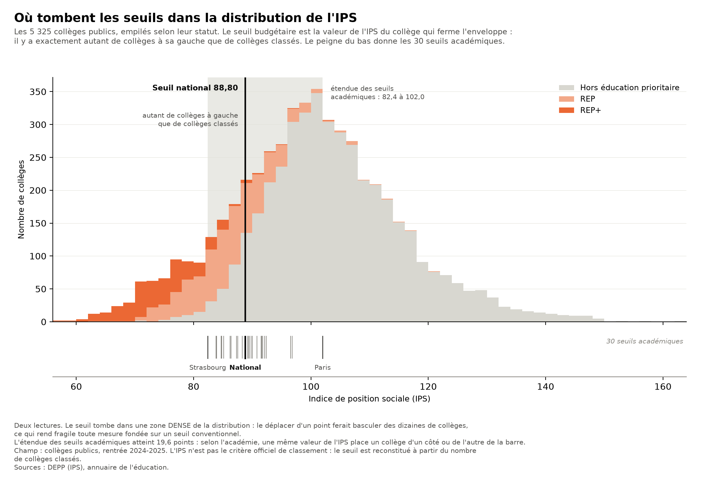

**Commentaire à ajouter moi meme**

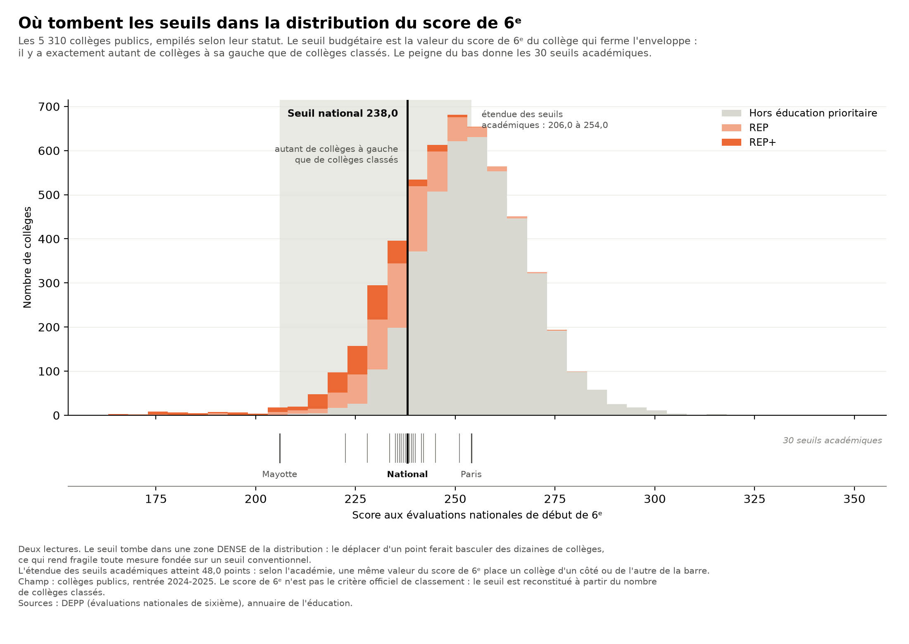

**Commentaire à ajouter moi meme**

### La distribution de l'écart au seuil

Les deux figures qui suivent n'utilisent **pas les mêmes bornes**, et c'est volontaire.
Pour l'IPS, les 3 points sont la recommandation de la DEPP — en deçà, une différence
n'est pas interprétable — et les 10 points une convention qui isole la queue extrême.

Pour le score de 6ᵉ, la DEPP ne publie aucun seuil. Mais elle publie l'**écart-type des
élèves de chaque collège**, ce qui permet de construire l'équivalent exact : 46 points
en médiane pour 113 élèves évalués, soit une **erreur-type de 4,3** sur la moyenne des
deux disciplines — elles corrèlent à +0,91, les moyenner ne réduit presque pas l'erreur.
Deux erreurs-types donnent **8 points**. La borne haute, elle, est calée sur la même
rareté que les 10 points d'IPS : **20 points**.

Reprendre 3 et 10 aurait été une faute. Ces bornes plaçaient **8,9 %** des collèges hors
de la bande centrale contre 4,8 % pour l'IPS : elles faisaient paraître le score de 6ᵉ
deux fois plus en désaccord avec la carte réelle qu'il ne l'est, uniquement parce
qu'elles sont trop serrées pour une mesure plus bruitée. Avec 8 et 20, les cinq plages
retombent à un point de celles de l'IPS.

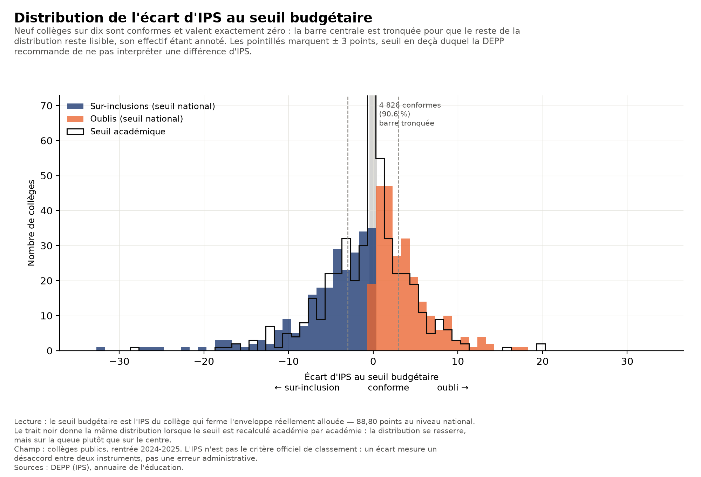

**Commentaire à ajouter moi meme**

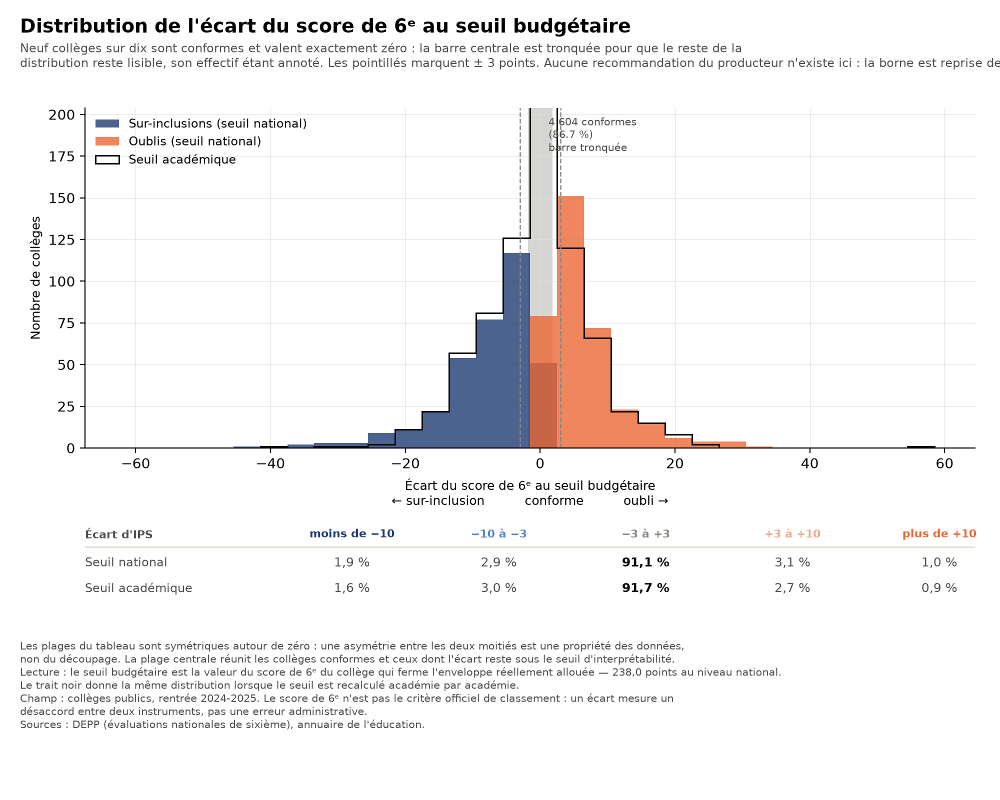

**Commentaire à ajouter moi meme**

Les deux cartes qui suivent retiennent, de chaque côté, les **50 plus gros écarts**.
La sélection se fait sur le rang et non sur un seuil fixe : les deux séries ont ainsi
le même effectif, ce qui rend les cartes directement comparables.

La contrepartie est instructive. **À effectif égal, les deux tops ne couvrent pas la
même étendue** : le cinquantième écart vaut 7,7 points du côté des sur-inclusions et
5,7 points seulement du côté des oublis. Il faut donc descendre plus bas pour réunir
cinquante oublis — une autre façon de constater que le dispositif se trompe plus fort
lorsqu'il classe que lorsqu'il omet. Dans le même sens : **aucun oubli n'atteint
20 points**, le plus fort valant 17,4, alors que six sur-inclusions dépassent ce
niveau.

#### Les sur-inclusions

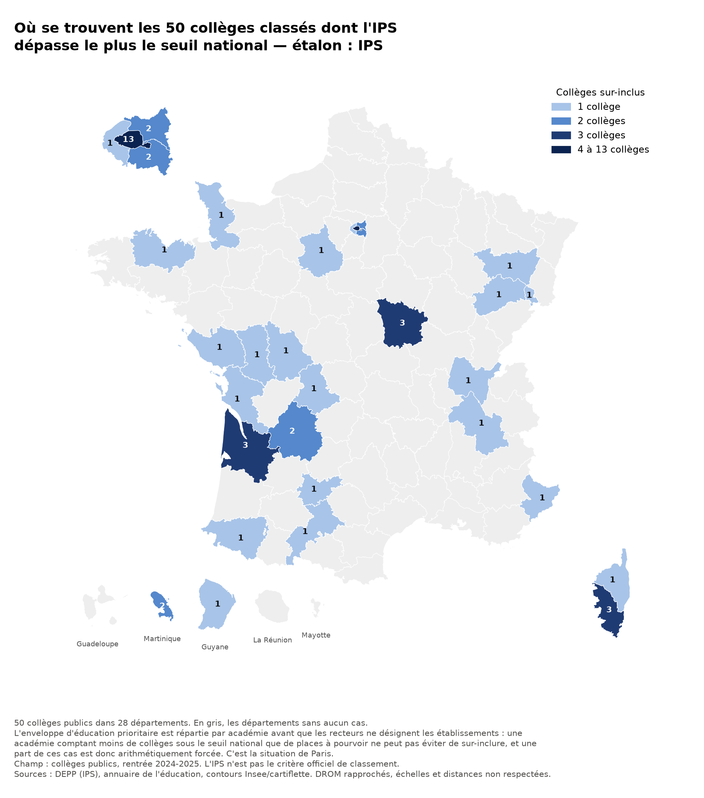

Vingt-huit départements sont concernés : **Paris en compte 13 à lui seul**, puis la
Gironde, la Nièvre et la Corse-du-Sud (3 chacun). Le fait notable est l'**absence de
motif géographique** : en dehors de Paris, les cas sont isolés et dispersés, sans
continuité territoriale. Il ne s'agit donc pas d'un phénomène régional mais d'une
accumulation de situations locales.

Au niveau académique, vingt académies sur trente sont représentées. Paris y détient
les 4 écarts supérieurs à 20 points et Bordeaux les 2 autres : à elles deux, ces
académies concentrent la totalité de la tranche haute.

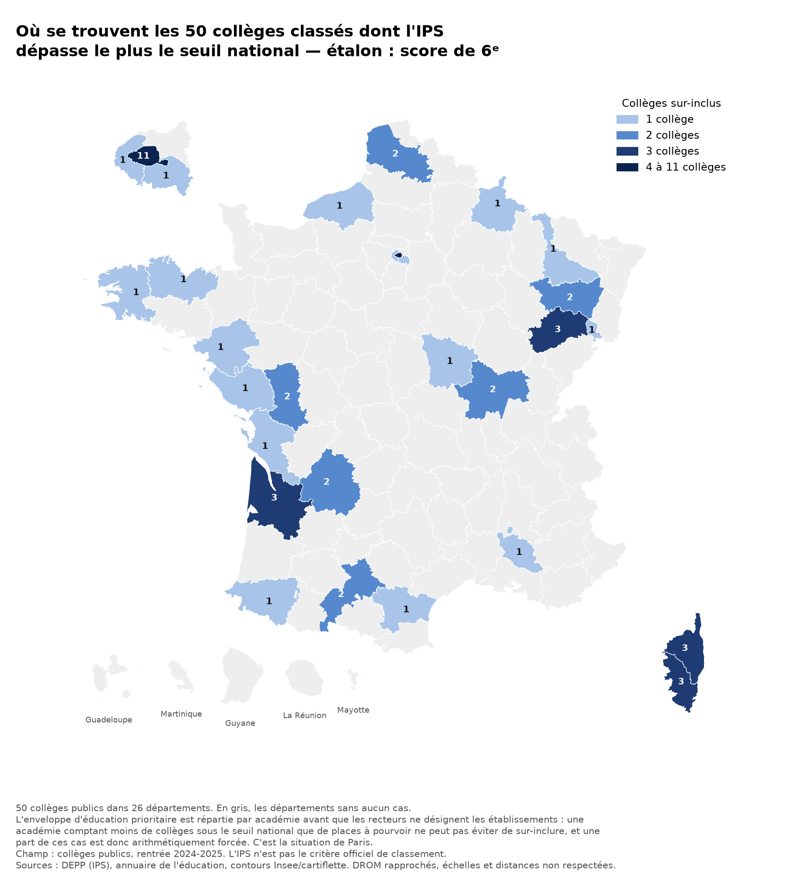

**Commentaire à ajouter moi meme**

#### Les oublis

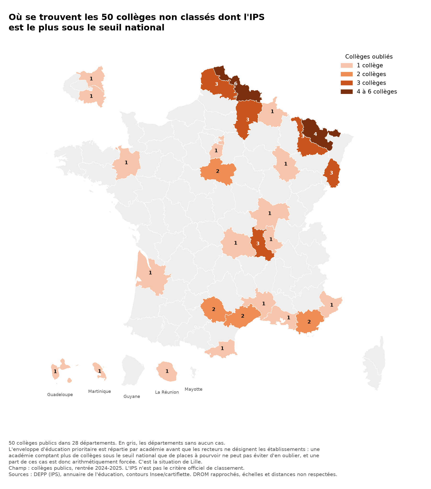

Vingt-huit départements également. Le **Nord en compte 6** et la Moselle 4, devant
l'Aisne, la Meurthe-et-Moselle, le Haut-Rhin, le Pas-de-Calais et la Loire (3
chacun). La répartition est ici franchement périphérique et continue — Nord,
Nord-Est, sillon rhodanien, arc méditerranéen — à l'inverse du semis dispersé des
sur-inclusions. Les deux cas les plus marqués sont le collège Gérard Philipe de
Clermont-Ferrand (IPS 71,4) et le collège Montesquieu d'Évry-Courcouronnes (71,8),
non classés alors que leur IPS les place parmi les plus défavorisés de France.

Au niveau académique, la concentration est d'une tout autre nature que du côté des
sur-inclusions : **Lille en compte 9 et Nancy-Metz 7**, soit un tiers du total à
elles deux, mais aucune ne domine comme Paris. Ce sont précisément deux académies
que l'arithmétique de l'enveloppe contraint — elles comptent plus de collèges sous
le seuil national que de places à pourvoir.

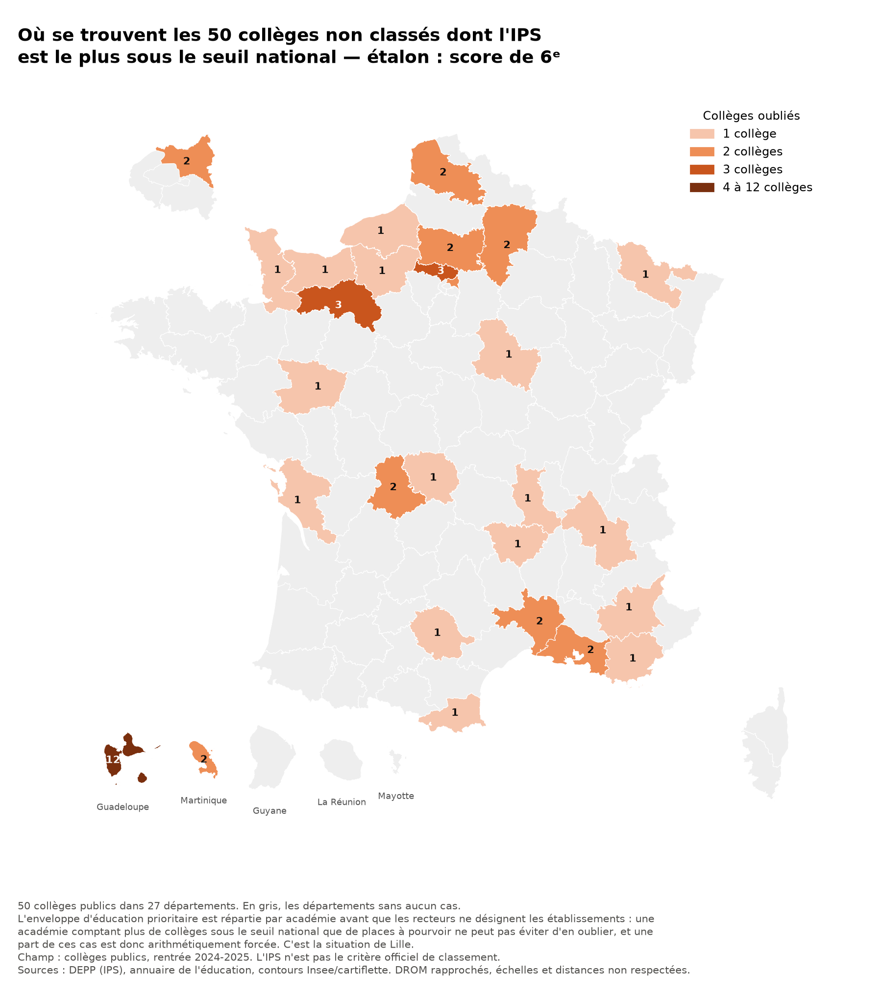

**Commentaire à ajouter moi meme**

### Pourquoi Paris n'est pas comparable aux autres

La répartition des réseaux par académie est arrêtée au niveau national ; le recteur
désigne ensuite les établissements dans l'enveloppe reçue. Or **Paris ne compte que
6 collèges sous le seuil national pour 30 places à pourvoir**. Le minimum de
sur-inclusions arithmétiquement possible y est donc de 24 — exactement le nombre
observé. Aucune carte parisienne à 30 collèges ne ferait mieux au regard d'un étalon
national.

Recalculé à l'intérieur de Paris, à enveloppe parisienne inchangée, le nombre de
sur-inclusions tombe de 24 à 8. `src/score_ecart.py` produit cette variante
académique en parallèle de la variante nationale, dans les mêmes fichiers.

Bordeaux, en revanche, résiste au changement d'étalon : l'IPS médian des collèges de
Gironde est de 107,4, et le collège le plus sur-inclus de France y atteint 121,0. Son
écart ne s'explique pas par un effet de repère.

### L'enveloppe reçue, académie par académie

Le cas parisien n'est pas isolé : il est l'extrême d'un mécanisme qui vaut partout.
La carte suivante généralise le raisonnement à toutes les académies en rapportant
les **places reçues** au nombre de collèges de l'académie qui figurent parmi les
**1 094 collèges d'IPS le plus faible du pays** — soit exactement le nombre de
places distribuées. Le ratio national vaut donc **1 par construction**, et la carte
se lit comme une redistribution à somme nulle : ce qu'une académie reçoit au-dessus
de 1, une autre le perd.

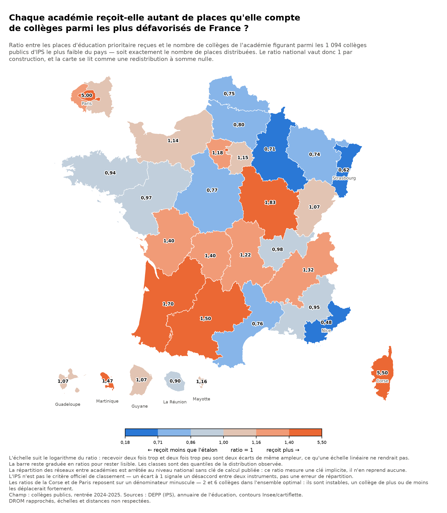

**Commentaire à ajouter moi meme**

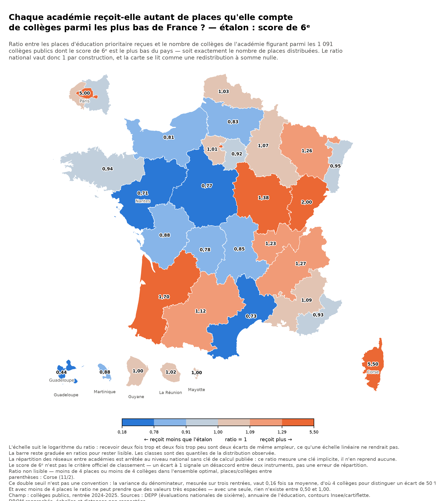

**Commentaire à ajouter moi meme**

#### Les deux étalons donnent-ils le même diagnostic ?

Les deux cartes ci-dessus ne se comparent pas facilement : on ne lit pas un déplacement
en confrontant deux teintes sur deux fonds distincts. Le nuage suivant met les deux
ratios face à face. La **diagonale** est la lecture principale — un point dessus signifie
que les deux étalons s'accordent exactement, et la distance à la diagonale mesure leur
désaccord. La surface du point donne le **poids** de l'académie : un ratio de 0,75 sur
118 places (Lille) ne pèse pas comme un ratio de 1,40 sur 7 places (Limoges).

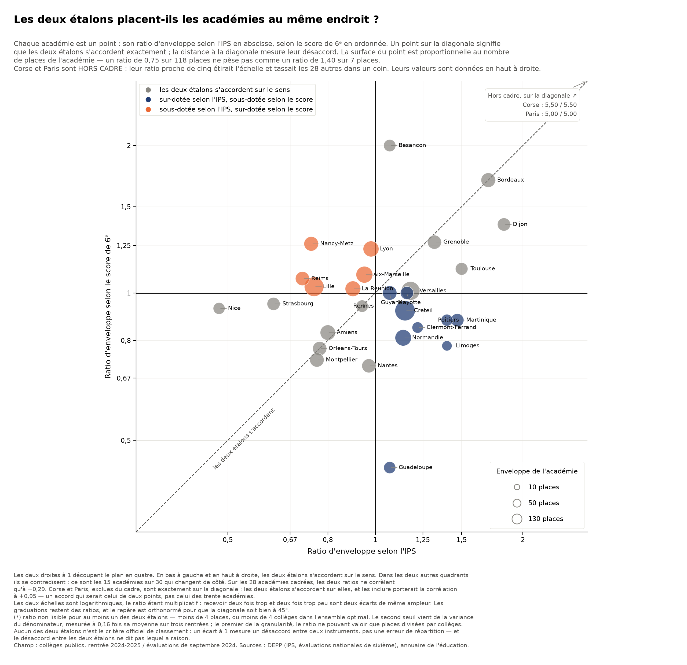

**Commentaire à ajouter moi meme**

### Le niveau à l'entrée en 6ᵉ suit-il l'IPS de l'académie ?

Les deux étalons mesurent deux choses distinctes — un milieu social et un niveau
scolaire — et la figure précédente montre qu'ils ne désignent pas les mêmes académies.
Reste à regarder leur relation directe, à l'échelle agrégée.

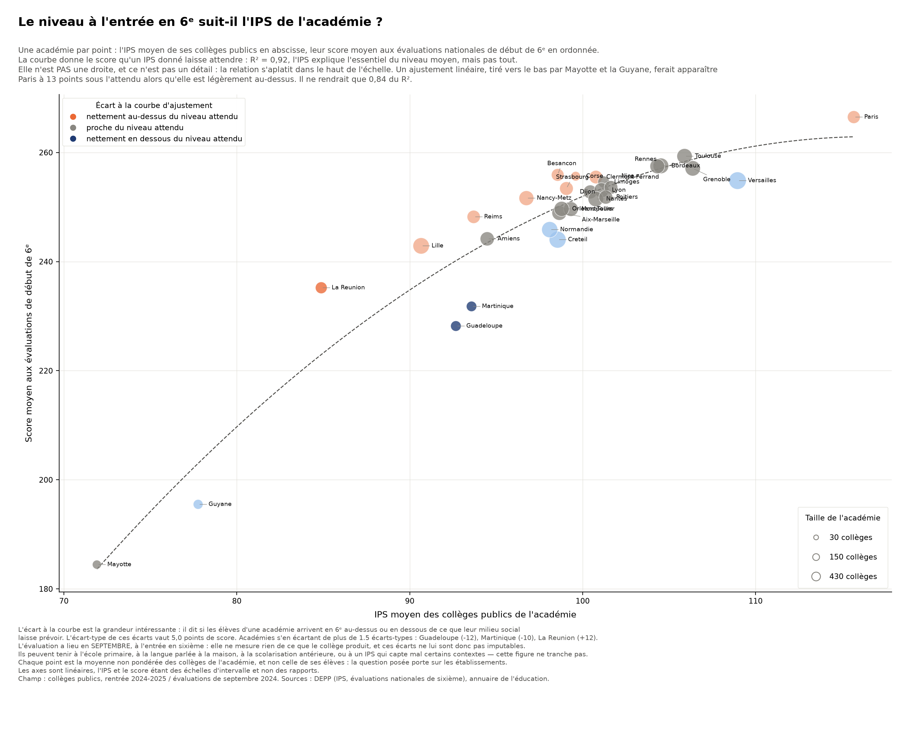

**Commentaire à ajouter moi meme**

*Cette mesure compare la carte réelle à un classement par IPS. L'IPS n'étant pas le
critère officiel, un écart signale un désaccord entre deux instruments — et non une
erreur administrative.*

---

## Et si l'on ne regardait que REP+ ?

Tout ce qui précède traite l'éducation prioritaire comme un bloc : 1 094 collèges
classés, REP et REP+ confondus. Ce second volet réduit l'enveloppe aux **362 places
REP+** et repose exactement la même question. La mécanique ne change pas d'une ligne —
seule la définition de « classé » change.

Le seuil devient plus sélectif : **77,80 points d'IPS** au lieu de 88,80, avec 5 ex
æquo seulement contre 11. Techniquement, l'instrument se comporte même mieux sur ce
périmètre plus étroit.

| | REP+ et REP | **REP+ seul** |
|---|---:|---:|
| Places | 1 094 | **362** |
| Seuil d'IPS | 88,80 | **77,80** |
| Collèges bien placés | 76,8 % | **72,1 %** |
| Écarts de chaque côté | 254 | **101** |

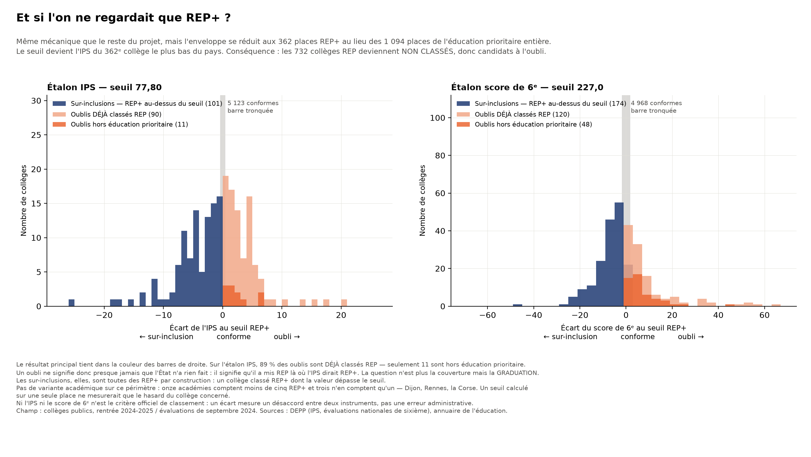

**Commentaire à ajouter moi meme**

### Le mot « oubli » ne veut plus dire la même chose

C'est le résultat propre à ce volet, et il faut le lire avant tout le reste.

**Sur les 101 collèges que l'IPS désigne sans que REP+ les retienne, 90 sont déjà
classés REP.** Onze seulement sont hors éducation prioritaire.

Un « oubli » ne signifie donc presque jamais que l'État n'a rien fait : il signifie
qu'il a mis **REP là où l'IPS dirait REP+**. On passe d'une question de **couverture**
— qui est aidé, qui ne l'est pas — à une question de **graduation** — qui est aidé au
bon niveau. Les deux cas sont distingués par la couleur sur la figure, sans quoi le mot
serait trompeur pour un lecteur venant de la première partie.

Avec le score de 6ᵉ, le décalage est plus marqué : 51,7 % de collèges bien placés
seulement, 168 oublis dont **48 hors éducation prioritaire**.

### Où se trouvent ces écarts

Les deux cartes reprennent la lecture de la première partie, mais avec une
information supplémentaire propre à ce volet : **le contour appuyé signale les
départements comptant au moins un oubli hors éducation prioritaire**. Partout
ailleurs, les oublis sont des collèges déjà classés REP.

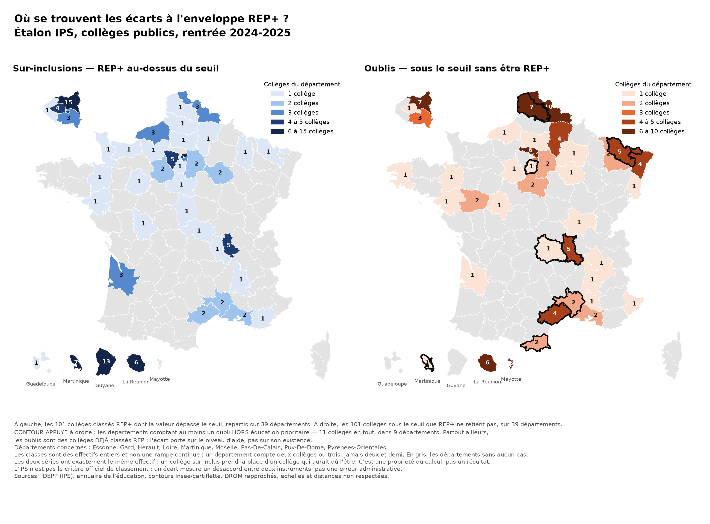

**Commentaire à ajouter moi meme**

Les onze oublis hors EP au sens de l'IPS se répartissent sur **neuf départements**
seulement — Essonne, Gard, Hérault, Loire, Martinique, Moselle, Pas-de-Calais,
Puy-de-Dôme, Pyrénées-Orientales. Avec le score de 6ᵉ, ils sont 48 dans 27
départements.

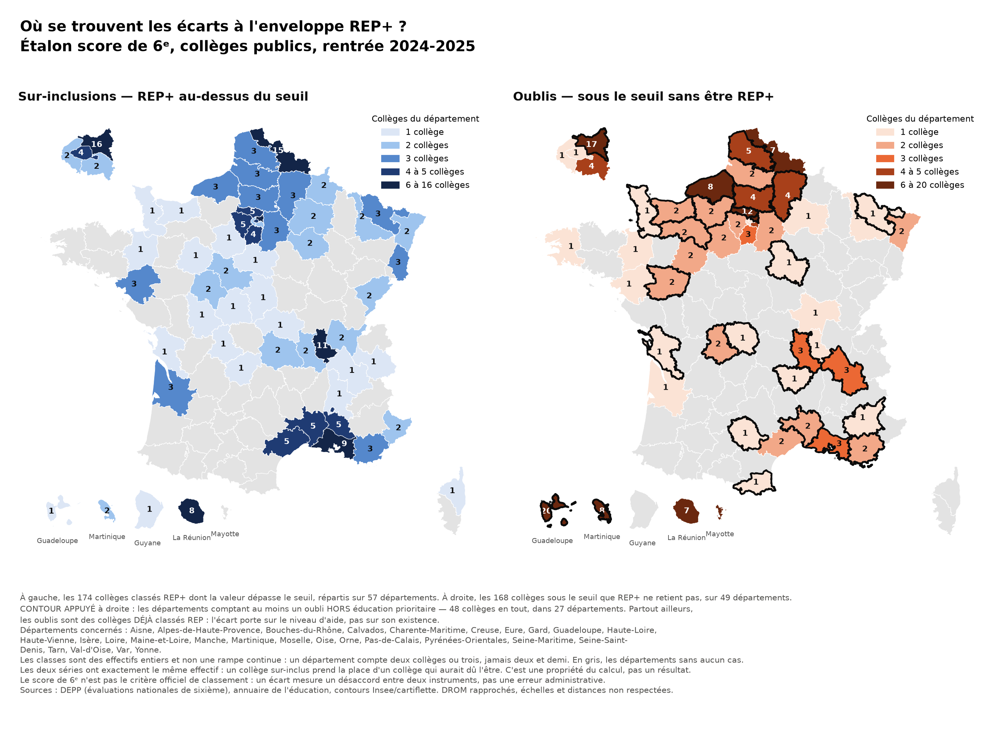

**Commentaire à ajouter moi meme**

### Le ratio d'enveloppe, académie par académie

Ce ratio ne demande **aucun seuil académique** — c'est ce qui le rend calculable ici.
Son dénominateur est le nombre de collèges de l'académie figurant parmi les 362
collèges les plus bas **du pays**. Le ratio national vaut donc 1 par construction, et
la carte se lit comme une redistribution à somme nulle.

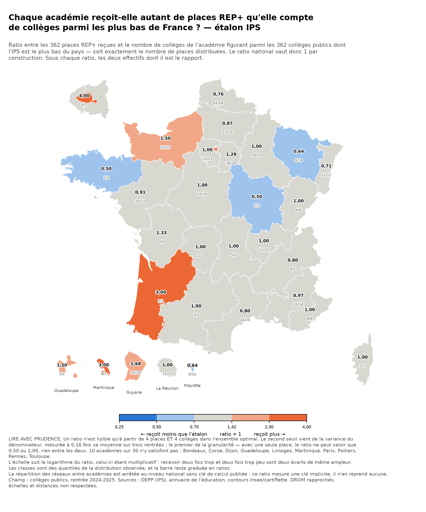

**Commentaire à ajouter moi meme**

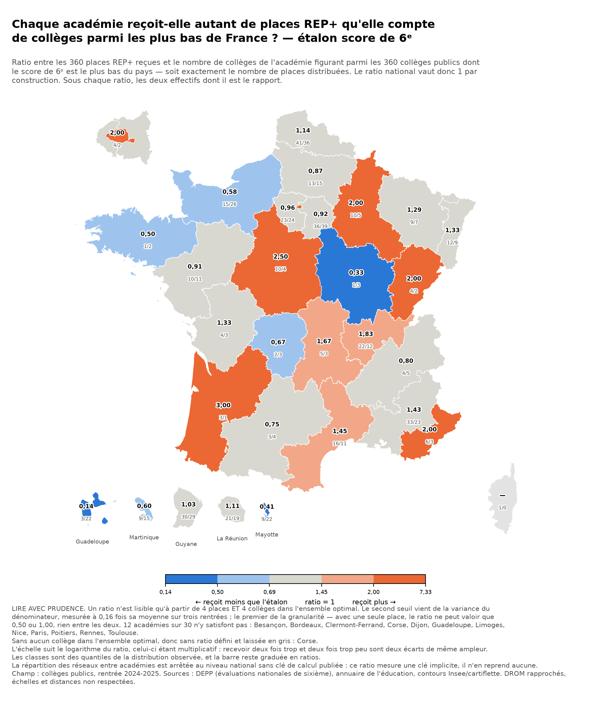

**Commentaire à ajouter moi meme**

**Ces deux cartes se lisent avec plus de prudence que leur équivalent de la première
partie.** Sur l'éducation prioritaire entière, le dénominateur descendait à deux
collèges ; sur REP+ il descend à **un** — Paris reçoit 4 places pour 1 collège dans
l'ensemble optimal, Bordeaux 3 pour 1. Les deux effectifs sont donc inscrits sous
chaque ratio : à cette échelle, « 4,00 » seul serait trompeur là où « 4/1 » est honnête.

Cas limite avec le score de 6ᵉ : **la Corse ne compte aucun collège dans l'ensemble
optimal**. Son ratio n'est pas infini, il n'existe pas — elle reste en gris.

#### Les deux étalons dotent-ils les mêmes académies ?

Comme dans la première partie, les deux cartes ne se comparent pas facilement. Le nuage
suivant les met face à face : la diagonale marque l'accord exact, et les deux droites à
1 séparent les quadrants.

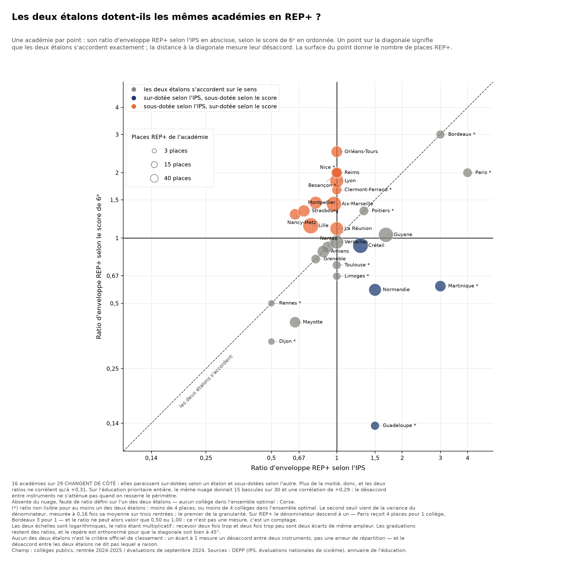

**Commentaire à ajouter moi meme**

**Seize académies sur vingt-neuf changent de côté** — plus de la moitié — et les deux
ratios ne corrèlent qu'à **+0,31**. Sur l'éducation prioritaire entière, le même nuage
donnait 15 bascules sur 30 et une corrélation de +0,29 : **le désaccord entre les deux
instruments ne s'atténue pas quand on resserre le périmètre**. La Corse est absente du
nuage, faute de ratio défini sur le score de 6ᵉ.

### Pourquoi pas de variante académique du score

Le reste du projet calcule le score d'écart deux fois, au seuil national et au seuil
académique. Sur REP+ la seconde n'a pas de sens : **onze académies comptent moins de
cinq REP+, et trois n'en comptent qu'un** — Dijon, Rennes, la Corse. Un seuil
budgétaire calculé sur une seule place ne mesurerait que le hasard du collège concerné.

C'est une limite du *seuil*, pas du *ratio* : les deux quantités n'ont pas le même
besoin. Le ratio ci-dessus reste calculable parce qu'il compare à un ensemble optimal
national, sans jamais avoir à trancher à l'intérieur d'une académie.

---

## Synthèse : le dispositif place-t-il chaque collège au bon niveau ?

Tout ce qui précède raisonne en binaire — classé ou non — et traite les deux niveaux
séparément. Or le dispositif est **gradué**, et un collège peut être mal placé de deux
manières très différentes : mettre REP là où il faudrait REP+ n'est pas la même chose
que ne rien mettre du tout.

Les deux matrices croisent les trois niveaux d'un coup. Chaque étalon réaffecte les
collèges **à enveloppes inchangées** : les 362 plus bas deviennent REP+, les 732
suivants REP, le reste hors éducation prioritaire. Les totaux de ligne égalent donc
exactement ceux de colonne — ce n'est pas un classifieur comparé à une vérité, mais une
**réallocation sous la même contrainte budgétaire**.

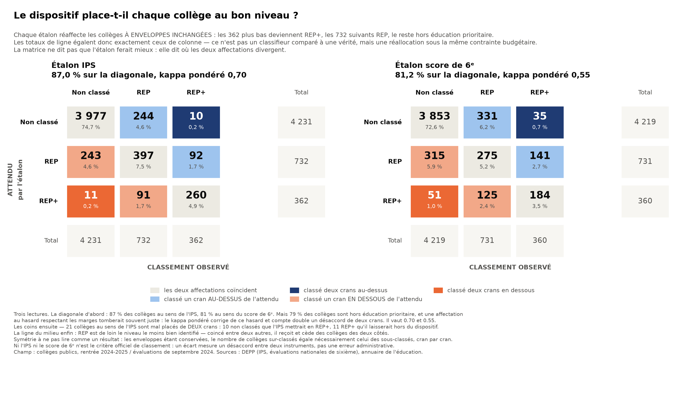

**Commentaire à ajouter moi meme**

Trois lectures.

**La diagonale** : 87,0 % des collèges au sens de l'IPS, 81,2 % au sens du score de 6ᵉ.
Mais 79 % des collèges sont hors éducation prioritaire, et une affectation au hasard
respectant les marges tomberait souvent juste. Le **kappa pondéré** corrige de ce
hasard et compte double un désaccord de deux crans : il vaut **0,70** et **0,55**.

**Les coins** : 21 collèges au sens de l'IPS sont mal placés de deux crans — 10 non
classés que l'IPS mettrait en REP+, et 11 REP+ qu'il laisserait hors du dispositif. Au
score de 6ᵉ, ils sont 86.

**La ligne du milieu** : REP est de loin le niveau le moins bien identifié — 397 sur
732 au sens de l'IPS, soit 54 %, contre 94 % pour les non classés et 72 % pour les
REP+. Coincé entre deux autres, il reçoit et cède des collèges des deux côtés.

Une symétrie à ne pas lire comme un résultat : les enveloppes étant conservées, le
nombre de collèges sur-classés égale **nécessairement** celui des sous-classés, cran par
cran. C'est une propriété du calcul.

### Les désaccords que les marges n'expliquent pas

La matrice précédente compte comme désaccord des écarts que l'instrument ne permet pas
de trancher. Les trois niveaux sont séparés par **deux seuils**, et autour de chacun
l'étalon est aveugle : **±3 points d'IPS** — la recommandation de la DEPP — et **±8
points de score de 6ᵉ**, soit deux erreurs-types de la moyenne d'un collège.

Un collège qui tombe dans l'une de ces marges a plusieurs niveaux plausibles. Son
classement observé ne peut donc pas être contredit s'il figure parmi eux.

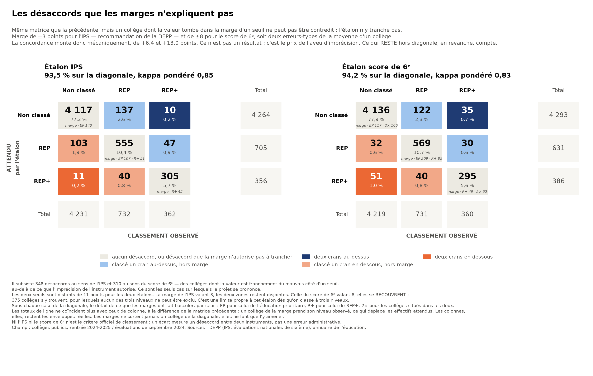

**Commentaire à ajouter moi meme**

| | Sans marge | **Avec marges** |
|---|---:|---:|
| IPS — diagonale | 87,0 % | **93,5 %** |
| IPS — kappa | 0,70 | **0,85** |
| Score de 6ᵉ — diagonale | 81,2 % | **94,2 %** |
| Score de 6ᵉ — kappa | 0,55 | **0,83** |

**Cette amélioration n'est pas un résultat** : c'est le prix de l'aveu d'imprécision. On
cesse simplement de compter comme désaccords des cas sur lesquels on ne peut pas se
prononcer. Ce qui **reste** hors diagonale, en revanche, compte : **348 collèges** au
sens de l'IPS et **310** au sens du score de 6ᵉ sont franchement du mauvais côté d'un
seuil, au-delà de ce que l'instrument autorise. Ce sont les seuls cas sur lesquels ce
travail se prononce.

**Une limite propre au score de 6ᵉ.** Les deux seuils sont distants de 11 points pour
les deux étalons. La marge de l'IPS valant 3, les deux zones restent disjointes. Celle
du score de 6ᵉ valant 8, **elles se recouvrent** : 375 collèges s'y trouvent, pour
lesquels aucun des trois niveaux ne peut être exclu. Le score de 6ᵉ est donc mal armé
pour un classement à trois niveaux — et c'est l'essentiel de son gain apparent.

Dernier point de lecture : les totaux de ligne ne coïncident plus avec ceux de colonne,
à la différence de la matrice précédente. Un collège de la marge prend son niveau
observé, ce qui déplace les effectifs attendus. Les colonnes, elles, restent les
enveloppes réelles.

## Limites

### Ce que mesure l'indicateur

**L'IPS est un indice construit, pas une observation directe.** Il repose sur les
PCS déclarées par les familles et enregistrées par les établissements. La DEPP
recommande de ne pas interpréter des différences de 3 points ou moins : les
classements fins entre établissements ou entre départements proches n'ont pas de
sens.

**Le score de 6ᵉ n'est pas une mesure de la performance du collège.** L'évaluation a
lieu en septembre, à l'entrée en sixième : les élèves n'ont encore rien reçu de
l'établissement. Le score mesure donc le niveau **à l'arrivée**. C'est un avantage
comme mesure du besoin — il n'est pas contaminé par les moyens que le collège reçoit
au titre de l'éducation prioritaire, contrairement à un résultat d'examen en fin de
cycle. Mais il ne dit rien de ce que le collège produit, et ce travail ne prétend
donc évaluer l'efficacité d'aucun dispositif.

Réserve résiduelle sur ce point : l'évaluation reste en aval de l'**école**, qui peut
elle-même relever de l'éducation prioritaire.

### Le champ retenu

**Le premier degré est hors champ.** C'est un choix assumé, justifié plus haut : les
écoles ont été labellisées par héritage du collège de secteur, sans indice propre.
Ce travail ne dit donc rien des « écoles orphelines » ni des désajustements du
premier degré, qui constituent pourtant une part importante du problème posé par la
carte de l'éducation prioritaire.

**13 collèges sont exclus** : 12 absents de l'annuaire et 1 sans IPS publié, soit
0,2 % du champ. Le biais est négligeable à cette échelle.

**Dix collèges REP+ manquent au fichier IPS** pour la rentrée 2024-2025, soit 2,7 %
des REP+. Ils ne sont pas écartés par le nettoyage : ils n'ont simplement pas de
ligne cette année-là. Étant par construction parmi les plus défavorisés, leur absence
atténue très légèrement les écarts mesurés.

**Le privé sous contrat est écarté** du calcul de couverture, aucun de ses collèges
n'étant classé. La question de la ségrégation entre secteurs public et privé,
pourtant centrale dans le débat sur les inégalités scolaires, n'est donc pas traitée
ici.

**Les lycées sont hors champ**, l'éducation prioritaire s'arrêtant au collège.

### Les choix de méthode

**Aucune pondération par les effectifs d'élèves — c'est la limite principale.** Ni le
fichier IPS ni l'annuaire ne fournissent d'effectif. Un collège de 150 élèves pèse
donc autant qu'un collège de 900 dans chaque taux calculé ici. Conséquence directe :
tous les résultats décrivent une part de **collèges**, jamais une part d'**élèves**.
Or une politique éducative vise des élèves. Ni les 33 collèges non couverts ni les
48 écarts extrêmes ne doivent être convertis en nombre d'enfants concernés.

**Le seuil de 10 % est conventionnel**, et son ciblage est plafonné par la taille de
l'enveloppe. Le nombre de collèges non couverts varie de 4 à 409 selon le seuil
retenu : aucun chiffre absolu ne doit être cité sans lui. C'est précisément ce que
le score d'écart évite, en déduisant son seuil de l'enveloppe observée.

**Une seule rentrée est analysée.** Aucune évolution n'est mesurée.

**L'analyse départementale de la couverture n'est pas conduite**, faute d'effectifs
suffisants : 14 départements seulement comptent au moins dix collèges défavorisés.
Les cartes de ce dépôt reposent sur le score d'écart, qui attribue une valeur à
chaque collège et n'a donc pas cette fragilité — sous réserve du seuil d'effectif
appliqué à chaque carte, rappelé dans sa note.

### Ce que ce travail ne dit pas

**Ce n'est pas une évaluation de l'efficacité de l'éducation prioritaire.** On mesure
la cohérence entre un classement et un indicateur social, jamais les effets du
dispositif sur les élèves qui en bénéficient.

**Aucune relation causale n'est établie.** L'analyse est intégralement descriptive.

**Le décalage temporel entre les deux instruments n'est pas traité.** La carte de
l'éducation prioritaire a été refondue en 2015 ; les IPS mobilisés datent de
2024-2025. Une divergence peut donc traduire une évolution sociale survenue depuis le
classement autant qu'une inadéquation d'origine. Distinguer les deux supposerait de
croiser une série temporelle d'IPS avec l'historique des révisions de la carte.

**Les critères réels du classement ne sont pas mobilisés, et ne peuvent pas l'être.**
Le classement repose sur un indice social composite construit par régression au
niveau du collège, dont ni la spécification ni les coefficients ni le seuil ne sont
publics. Ce travail confronte donc deux instruments de mesure ; il ne reconstitue pas
la décision administrative et ne peut à aucun moment conclure qu'un établissement est
« mal classé ».

**Une part des divergences est imputable à la carte, non à la mesure.** La carte de
2015 s'écarte substantiellement de son propre indice social : 206 entrées et
195 sorties réalisées pour 350 et 350 prescrites. Une fraction des écarts observés
ici reflète donc des arbitrages locaux de 2014, et non une inadéquation entre l'IPS
et les critères officiels. Faute d'accès à la carte théorique, cette fraction n'est
pas quantifiable.

**Le premier degré n'est pas traité.** Le label d'une école découlant de celui de
son collège de secteur, la confronter à son propre IPS reviendrait à juger une
décision prise ailleurs. Ce travail ne dit donc rien des désajustements du premier
degré, qui pèsent pourtant lourd dans la critique de la carte.

---

## Prolongements possibles

- Pondérer par les effectifs d'élèves, pour passer d'une part de collèges à une part
  d'élèves — la limite principale de ce travail. Le jeu de données IPS ne fournit
  pas l'effectif ; il faudrait le joindre depuis une autre source du ministère.
- Mobiliser les trois rentrées du fichier IPS plutôt qu'une seule, afin d'examiner
  si les écarts se creusent ou se résorbent.
- Croiser avec les données de revenu médian communal de l'Insee (Filosofi) pour
  confronter l'IPS à une mesure indépendante du niveau de vie local.
- Corriger le recouvrement académique de la taille de l'enveloppe, dont il dépend
  mécaniquement, avant d'en tirer un classement de qualité de la décision locale.
- Étendre l'analyse au premier degré, en reconstituant d'abord le rattachement
  école → collège de secteur, sans lequel la comparaison n'a pas de sens.

---

## Sources

**Données**

- [IPS des collèges](https://data.education.gouv.fr/explore/dataset/fr-en-ips-colleges-ap2023/) — DEPP
- [Annuaire de l'éducation](https://data.education.gouv.fr/explore/dataset/fr-en-annuaire-education/) — ministère chargé de l'Éducation nationale
- [Évaluations nationales de début de sixième par établissement](https://data.education.gouv.fr/explore/dataset/fr-en-evaluations_nationales_6eme_par_etablissement/) — DEPP
- Contours départementaux : [cartiflette](https://github.com/InseeFrLab/cartiflette), laboratoire d'innovation de l'Insee, d'après IGN ADMIN EXPRESS

**Construction et critique du classement REP / REP+**

- [L'éducation prioritaire, une politique publique à repenser](https://www.ccomptes.fr/fr/publications/leducation-prioritaire-une-politique-publique-repenser) — Cour des comptes, 2025. Texte intégral en [annexe du rapport sénatorial n° 575](https://www.senat.fr/rap/r24-575/r24-575-annexe.pdf) : construction de l'indice social (p. 24), rattachement des écoles et écoles orphelines (p. 57-59)
- [Refondation de l'éducation prioritaire](https://www.education.gouv.fr/bo/14/Hebdo23/MENE1412775C.htm) — circulaire du 4 juin 2014
- [Critères de classement des écoles en réseau d'éducation prioritaire](https://www.senat.fr/questions/base/2025/qSEQ251106739.html) — question au Sénat et réponse ministérielle, 2025
- [Révision des zonages des réseaux d'éducation prioritaire](https://www.senat.fr/questions/base/2022/qSEQ221103796.html) — réponse ministérielle, avril 2023 : la carte n'a pas été révisée depuis 2015
- [L'éducation prioritaire](https://www.education.gouv.fr/l-education-prioritaire-3140) — ministère chargé de l'Éducation nationale : 1 093 réseaux à la rentrée 2023

**Méthodologie de l'IPS**

- Rocher, T. (2016), « Construction d'un indice de position sociale des élèves », *Éducation & formations*, DEPP, n° 90, pp. 5-27
- Dauphant, F., Evain, F., Guillerm, M., Simon, C., Rocher, T. (2023), « L'indice de position sociale (IPS) : un outil statistique pour décrire les inégalités sociales entre établissements », *Note d'information de la DEPP* n° 23.16
- [L'indice de position sociale (IPS)](https://www.education.gouv.fr/l-indice-de-position-sociale-ips-357755) — ministère chargé de l'Éducation nationale

**Sur la publication des IPS**

- [Indice de position sociale](https://fr.wikipedia.org/wiki/Indice_de_position_sociale) — Wikipédia
- [Comment un journaliste a obtenu les données sur les IPS](https://www.lucyol.fr/blog/ips)
- [Mixité sociale à l'École : comment est construit « l'IPS » ?](https://www.publicsenat.fr/actualites/societe/mixite-sociale-a-lecole-comment-est-construit-lips-lindice-de-position-sociale) — Public Sénat

Voir aussi [`docs/dictionnaire_donnees.md`](docs/dictionnaire_donnees.md) pour la
description détaillée des trois fichiers et des pièges de jointure.

## Auteur

Rémy Darquin
